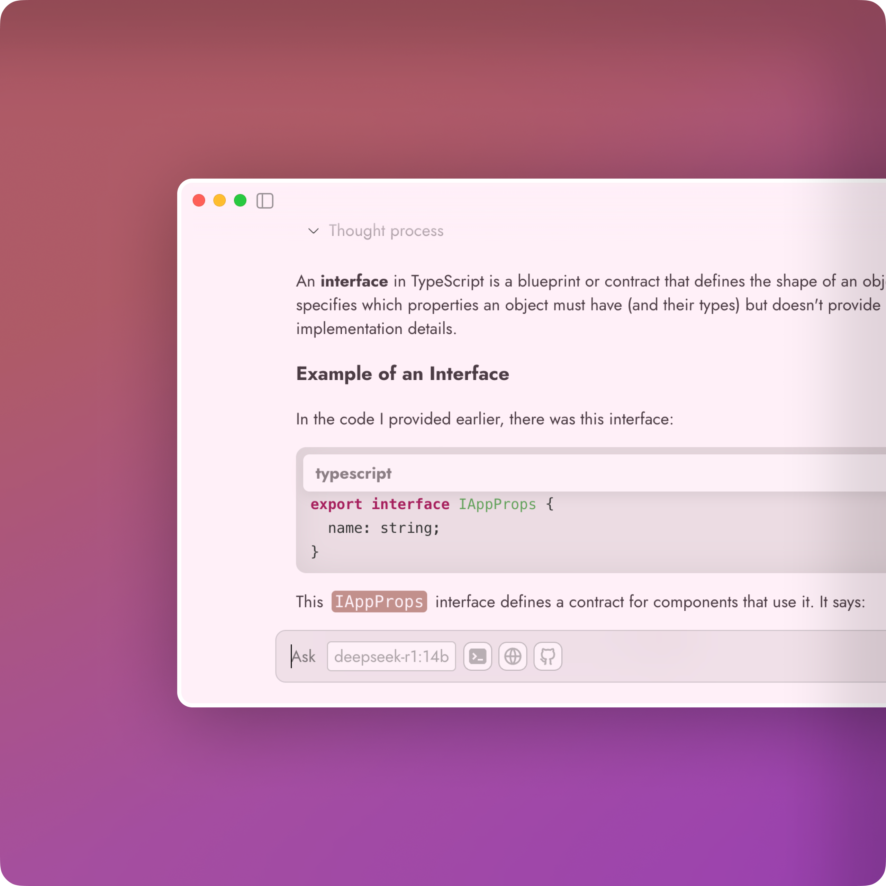

<link
  href="https://fonts.googleapis.com/css2?family=Jost:wght@400;700&display=swap"
  rel="stylesheet"
></link>

#  PuPu

**" A simple and easy to use UI for the Ollama. "**

PuPu is a lightweight tool that makes it easy to run AI models on your own device. Designed for smooth performance and ease of use, PuPu is perfect for anyone who wants quick access to AI without technical complexity.

## Download the App

[![Download for Windows][windows-shield]][windows-url] 
[![Download for Mac][macos-shield]][macos-url]

## Table of Contents

- [Local Setup](#local-setup)
- [Deployment](#deployment)

### Local Setup 

- Install dependencies: To run the electron app locally, you need to install the dependencies by running the following command:

`npm install`

- Rebuild the Electron App: After installing the dependencies, you need to rebuild the electron app by running the following command:

`npx electron-rebuild`

- Run the Electron App: Once the dependencies are installed, you can run the app by running the following command:

`npm start`

- Build the React App:  In order to build the app for different platforms, you should build the React app first by running the following command:

### Deployment 

`npm run build`

- Build the Electron App: Once the React app is built, you can build the electron app for different platforms by running the following command:

`npx electron-builder --mac`  (for mac) 

`npx electron-builder --win`  (for windows) Notice: Windows might require you to run the command in an administrator shell. 

`npx electron-builder --linux`  (for linux) 

[windows-shield]: https://img.shields.io/badge/download_for_windows-AA3E71?style=for-the-badge&logo=windows&logoColor=FFFFFF&labelColor=FFFFFF
[windows-url]: https://github.com/haoxiang-xu/PuPu/releases/tag/v0.0.1
[macos-shield]: https://img.shields.io/badge/download_for_mac-AA3E71?style=for-the-badge&logo=apple&logoColor=FFFFFF&labelColor=AA3E71
[macos-url]: https://github.com/haoxiang-xu/PuPu/releases/tag/v0.0.1
