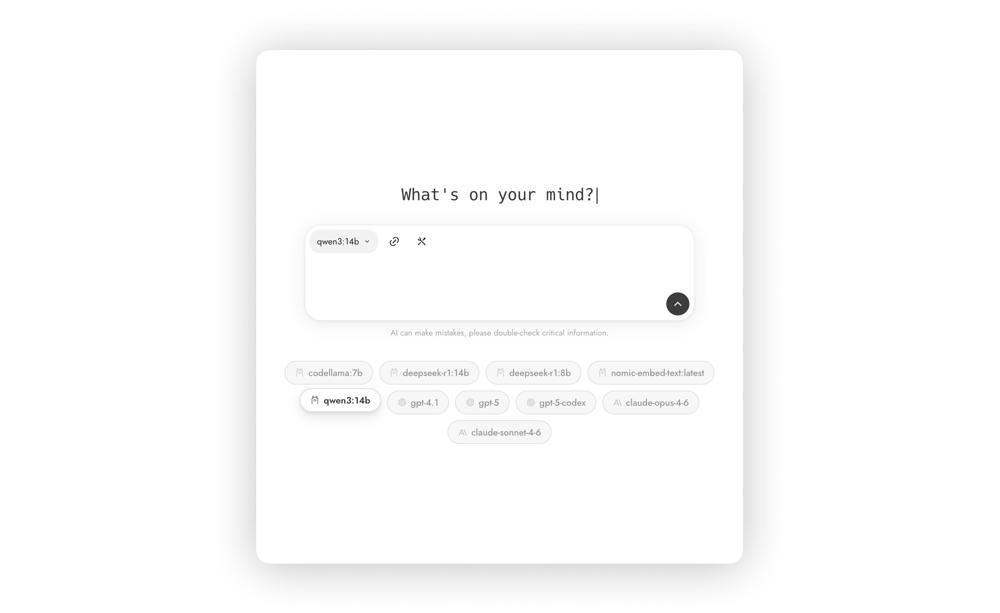

<link
  href="https://fonts.googleapis.com/css2?family=Jost:wght@400;700&display=swap"
  rel="stylesheet"
></link>

<div align="center">
  
  <h1>PuPu</h1>
  <p>Local AI, beautifully simple.</p>
  <br>
  <a href="https://github.com/haoxiang-xu/PuPu/releases/tag/v0.1.0">
    
  </a>&nbsp;&nbsp;
  <a href="https://github.com/haoxiang-xu/PuPu/releases/tag/v0.1.0">
    
  </a>&nbsp;&nbsp;
  <a href="https://github.com/haoxiang-xu/PuPu/releases/tag/v0.1.0">
    
  </a>
</div>
<br><br>

PuPu is a lightweight desktop client for running AI models locally. Designed for smooth performance and privacy, it brings AI to your fingertips — no cloud, no complexity.



## Table of Contents

- [For Users](#for-users)
  - [App installation](#app-installation)
- [For Developers](#for-developers)
  - [Miso Setup](#miso-setup)
  - [Local Setup](#local-setup)
  - [Deployment](#deployment)

## For Users <a name="for-users"></a>

### App installation <a name="app-installation"></a>

### Windows

<a href="https://github.com/haoxiang-xu/PuPu/releases/tag/v0.1.0"></a>

- Download the `.exe` Windows installer [here](https://github.com/haoxiang-xu/PuPu/releases/tag/v0.1.0).
- Run the installer and follow the instructions.
- Once the installation is complete, you can find the app in the start menu.

### Mac

<a href="https://github.com/haoxiang-xu/PuPu/releases/tag/v0.1.0"></a>

- Download the `.dmg` Mac installer [here](https://github.com/haoxiang-xu/PuPu/releases/tag/v0.1.0).
- Open the downloaded file and drag the app to the Applications folder.
- Once the installation is complete, you can find the app in the Applications folder.

### Linux

<a href="https://github.com/haoxiang-xu/PuPu/releases/tag/v0.1.0"></a>

- Download the `.deb` or `.AppImage` file [here](https://github.com/haoxiang-xu/PuPu/releases/tag/v0.1.0).
- If you downloaded the `.deb` file, run the following command in the terminal:

```bash
sudo dpkg -i PuPu-0.1.0.deb
```

OR

```bash
sudo apt install ./PuPu-0.1.0.deb
```

- Ensuring Proper Sandbox Permissions: <span style="opacity: 0.32">If you encounter an error message about sandbox permissions, you can run the following command:</span>

```bash
sudo chown root:root /opt/PuPu/chrome-sandbox
sudo chmod 4755 /opt/PuPu/chrome-sandbox
```

## For Developers <a name="for-developers"></a>

### Miso Setup <a name="miso-setup"></a>

PuPu starts a local Miso sidecar process when running the Electron app.

In development, PuPu looks for a valid Miso source in this order:

1. `MISO_SOURCE_PATH` (if set)
2. sibling folder `../miso`

A valid Miso source must contain:

- `miso/__init__.py`
- `miso/broth.py`

Recommended setup:

1. Put the Miso repo next to PuPu:

```bash
# parent folder of PuPu
cd ..
git clone <your-miso-repo-url> miso
cd PuPu
```

2. Create a Python environment for the PuPu sidecar runtime:

```bash
python3 -m venv ./.venv
source ./.venv/bin/activate
# Windows: .\\.venv\\Scripts\\activate
pip install -r ./miso_runtime/server/requirements.txt
```

3. Install dependencies for your Miso repo (inside `../miso`) based on that repo's instructions.

4. Configure Miso runtime environment variables (examples):

```bash
# optional if your miso repo is already at ../miso
export MISO_SOURCE_PATH=/absolute/path/to/miso

# optional override for Python executable used to launch miso sidecar
export MISO_PYTHON_BIN=/absolute/path/to/python

# optional (default: ollama)
export MISO_PROVIDER=ollama

# optional (provider-specific default will be used if omitted)
export MISO_MODEL=deepseek-r1:14b

# required when MISO_PROVIDER is openai or anthropic
export MISO_API_KEY=<your_api_key>
# or use provider-specific keys:
# export OPENAI_API_KEY=<your_api_key>
# export ANTHROPIC_API_KEY=<your_api_key>
```

Quick checks:

- If `MISO_PROVIDER=ollama`, ensure Ollama is running and the selected model is installed.
- Start PuPu with `npm start` and confirm Miso status in the app is `ready`.

#### Build packaged Miso sidecar (release)

For packaged apps, build a standalone `miso-server` binary first:

```bash
# macOS arm64
npm run build:miso:mac
```

Output path:

```bash
miso_runtime/dist/macos/miso-server
```

Notes:

- The script is `miso_runtime/scripts/build_miso_server.sh`.
- Default Miso source is `../miso`. Override with `MISO_SOURCE_PATH` when needed.
- First run creates `./.venv-miso-build` and installs build dependencies.
- First run needs network access to install `pyinstaller` and Python deps.
- If deps are already prepared, run with `MISO_BUILD_SKIP_INSTALL=1`.

### Local Setup <a name="local-setup"></a>

- Install dependencies: <span style="opacity: 0.32">To run the electron app locally, you need to install the dependencies by running the following command:</span>

`npm install`

- Rebuild the Electron App: <span style="opacity: 0.32">After installing the dependencies, you need to rebuild the electron app by running the following command:</span>

`npx electron-rebuild`

- Run the Electron App: <span style="opacity: 0.32">Once the dependencies are installed, you can run the app by running the following command:</span>

`npm start`

- Browse built-in Mini UI components:
  <span style="opacity: 0.32">After local startup, open the following page to preview available Mini UI native components:</span>

`http://localhost:2907/mini`

### Deployment <a name="deployment"></a>

Simple release flow (macOS arm64):

1. Make sure Miso source exists at `../miso`.
   - Or set a custom path:

```bash
export MISO_SOURCE_PATH=/absolute/path/to/miso
```

2. Install dependencies:

```bash
npm install
```

3. Build release package:

```bash
npm run build:electron:mac
```

This single command will:

- build `miso-server` (`miso_runtime/dist/macos/miso-server`)
- build the web app
- build the macOS arm64 installer

Output files:

- `dist/PuPu-<version>-arm64.dmg`
- `dist/mac-arm64/PuPu.app`

Quick check:

```bash
test -f "dist/mac-arm64/PuPu.app/Contents/Resources/miso_runtime/dist/macos/miso-server" && echo "miso bundled"
```

Other platforms (run on matching OS host):

```bash
npm run build:electron:win
npm run build:electron:linux
```
