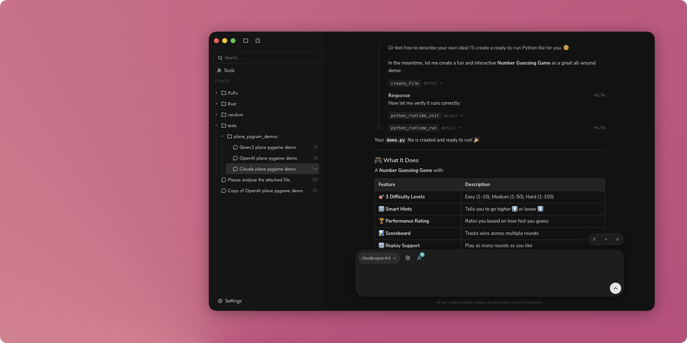

<div align="center">
  
  <h1>PuPu</h1>
  <p>Your AI, your way — beautifully simple.</p>
  <p>
    A desktop AI client for local and cloud models, with workspace-aware chat in one clean app.
  </p>
  <p>
    <a href="https://github.com/haoxiang-xu/PuPu/releases/latest">
      
    </a>
    &nbsp;&nbsp;
    <a href="https://github.com/haoxiang-xu/PuPu/releases/latest">
      
    </a>
    &nbsp;&nbsp;
    <a href="https://github.com/haoxiang-xu/PuPu/releases/latest">
      
    </a>
  </p>
</div>

PuPu is a cross-platform desktop AI client that lets you chat with local models through Ollama or connect to cloud providers such as OpenAI and Anthropic. It is built for people who want one fast desktop app for everyday AI work, not a browser tab maze.

If you find the project useful, star the repo.


## Why PuPu

- Local and cloud models in one place
  - Use Ollama for local models, or switch to supported hosted providers when you need them.
- Workspace-aware chat
  - Attach a project folder so PuPu can work with your local files in context.
- A cleaner desktop workflow
  - Keep conversations, settings, and tools inside one native app on macOS, Windows, and Linux.
- Built for real usage
  - Manage multiple chats, keep context close to your work, and avoid bouncing between disconnected tools.

## Get PuPu

Download the latest release:

- [macOS](https://github.com/haoxiang-xu/PuPu/releases/latest)
- [Windows](https://github.com/haoxiang-xu/PuPu/releases/latest)
- [Linux](https://github.com/haoxiang-xu/PuPu/releases/latest)

### Windows

1. Download the latest `.exe` installer from the [latest release page](https://github.com/haoxiang-xu/PuPu/releases/latest).
2. Run the installer.
3. Launch PuPu from the Start menu.

### macOS

1. Download the latest `.dmg` from the [latest release page](https://github.com/haoxiang-xu/PuPu/releases/latest).
2. Open the disk image.
3. Drag PuPu into `Applications`.
4. Launch PuPu from `Applications`.

### Linux

1. Download the latest `.deb` or `.AppImage` from the [latest release page](https://github.com/haoxiang-xu/PuPu/releases/latest).
2. If you use the `.deb`, install it with:

```bash
sudo apt install ./PuPu-<version>.deb
```

3. If your system reports a Chromium sandbox permission error, run:

```bash
sudo chown root:root /opt/PuPu/chrome-sandbox
sudo chmod 4755 /opt/PuPu/chrome-sandbox
```

## Quick Start

1. Open PuPu.
2. Choose how you want to run models:
   - local with Ollama
   - cloud with a supported provider such as OpenAI or Anthropic
3. Add any API key or provider settings in the app if needed.
4. Optionally attach a workspace folder so PuPu can work with local files in context.
5. Start chatting.

## What You Can Do

### Work With Local Models

Run supported Ollama models directly from your machine without leaving the desktop app.

### Connect To Hosted Providers

Switch to supported cloud providers when you want stronger hosted models or a different workflow.

### Attach A Workspace

Give PuPu a workspace and keep the conversation tied to the files you are actually working on.

### Keep Chats Organized

Manage multiple conversations without losing context or cluttering your workflow.

## Screenshots



## Roadmap

- Agent Builder
- Agent Teams and Skills
- MCP integration

## Contributing

Contributions are welcome.

By intentionally submitting a contribution, you agree to the terms in
[docs/CLA.md](./docs/CLA.md). In short:

- you keep ownership of your contribution;
- the project may ship your contribution under Apache-2.0; and
- the project may also reuse or relicense accepted contributions in future
  commercial, dual-licensed, source-available, or proprietary offerings.

If you are contributing code or assets owned by your employer or client, make
sure you have authority to do so before opening a pull request.

## License And Trademark

PuPu is distributed under the [Apache License 2.0](./LICENSE).

This means the code can be used, modified, and redistributed commercially, but
the PuPu name and brand are not automatically included in those rights.

- License text: [LICENSE](./LICENSE)
- Project notices: [NOTICE](./NOTICE)
- Contributor terms: [docs/CLA.md](./docs/CLA.md)
- Brand usage rules: [docs/TRADEMARK_POLICY.md](./docs/TRADEMARK_POLICY.md)

If you ship a modified fork, rename it and replace PuPu branding unless you
have written permission to use the marks.

## Support

- Found a bug or want to request something: [open an issue](https://github.com/haoxiang-xu/PuPu/issues)
- Want the latest downloadable builds: [see releases](https://github.com/haoxiang-xu/PuPu/releases/latest)
