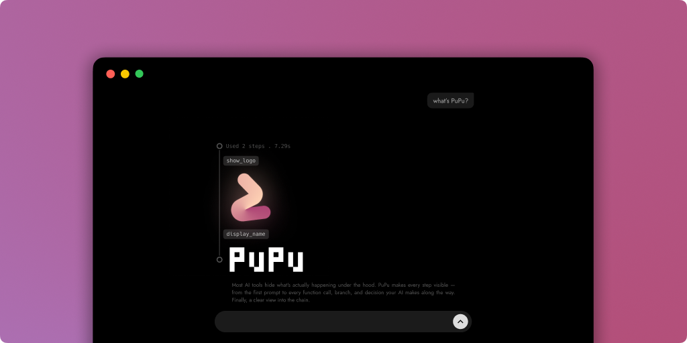
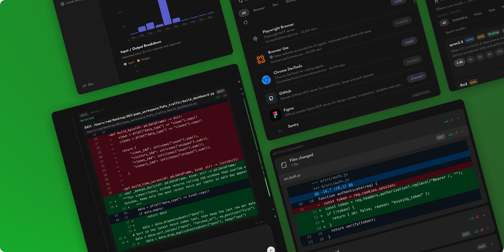

<div align="center">
  
  <h1>PuPu</h1>
  <p>Your AI, your way — beautifully simple.</p>
  <p>
    A desktop AI client for local and cloud models — workspace-aware chat and a
    built-in MCP tool store, in one clean native app.
  </p>
  <p>
    <a href="#macos">
      
    </a>
    &nbsp;&nbsp;
    <a href="#windows">
      
    </a>
    &nbsp;&nbsp;
    <a href="#linux">
      
    </a>
  </p>
</div>

PuPu is a cross-platform desktop AI client that lets you chat with local models through Ollama or connect to cloud providers such as OpenAI and Anthropic. It is built for people who want one fast desktop app for everyday AI work, not a browser tab maze.

If you find the project useful, ⭐⭐⭐ star the repo.



## Why PuPu

- Local and cloud models in one place
  - Use Ollama for local models, or switch to supported hosted providers when you need them.
- Workspace-aware chat
  - Attach a project folder so PuPu can work with your local files in context.
- A cleaner desktop workflow
  - Keep conversations, settings, and tools inside one native app on macOS, Windows, and Linux.
- An extensible tool ecosystem
  - Add capabilities through the built-in MCP store, or contribute your own.
- Built for real usage
  - Manage multiple chats, keep context close to your work, and avoid bouncing between disconnected tools.

## Get PuPu

<!-- release-downloads:start -->
**v0.1.10** — Choose your platform and click to download.

> **Coming soon:** v0.1.10 is currently a draft. The download buttons below become publicly available after publication. For the current public version, see the [latest release](https://github.com/haoxiang-xu/PuPu/releases/latest).

<a id="macos"></a>

### macOS

[](https://github.com/haoxiang-xu/PuPu/releases/download/v0.1.10/PuPu-0.1.10-macos-arm64.dmg)
[](https://github.com/haoxiang-xu/PuPu/releases/download/v0.1.10/PuPu-0.1.10-macos-x64.dmg)

**Not sure which Mac you have?** Open **Apple menu → About This Mac**. Choose **Apple Silicon** for an Apple M-series chip, or **Intel** for an Intel processor.

<a id="windows"></a>

### Windows

[](https://github.com/haoxiang-xu/PuPu/releases/download/v0.1.10/PuPu-0.1.10-windows-x64-setup.exe)

Run the installer, then launch PuPu from the Start menu.

<a id="linux"></a>

### Linux

[](https://github.com/haoxiang-xu/PuPu/releases/download/v0.1.10/PuPu-0.1.10-linux-x64.deb)
[](https://github.com/haoxiang-xu/PuPu/releases/download/v0.1.10/PuPu-0.1.10-linux-x64.AppImage)

For the `.deb`, download it first and install it with:

```bash
sudo apt install ./PuPu-0.1.10-linux-x64.deb
```

<!-- release-downloads:end -->

**Upgrading from 0.1.9?** Download and install the matching package manually. Automatic updating from 0.1.9 to 0.1.10 has not been verified. Back up important chats and settings before upgrading.

## Quick Start

1. Open PuPu.
2. Choose how you want to run models:
   - local with Ollama
   - cloud with a supported provider such as OpenAI or Anthropic
3. Add any API key or provider settings in the app if needed.
4. Optionally attach a workspace folder so PuPu can work with local files in context.
5. Start chatting.

## 🧩 Extend PuPu — Tools & MCP

PuPu has a built-in MCP tool store, and the catalog is open to the community.

- **Add a tool the easy way** — [submit an MCP server](https://github.com/haoxiang-xu/PuPu/issues/new?template=submit-mcp-server.yml)
  with a short form, no code required.
- **Prefer a PR?** Edit the catalog directly — see the
  [submission guide](./docs/contributing/mcp-store-submission.md).

New entries are security-reviewed before they ship. Full details in
[CONTRIBUTING.md](./CONTRIBUTING.md).

## What You Can Do

### Work With Local Models

Run supported Ollama models directly from your machine without leaving the desktop app.

### Connect To Hosted Providers

Switch to supported cloud providers when you want stronger hosted models or a different workflow.

### Attach A Workspace

Give PuPu a workspace and keep the conversation tied to the files you are actually working on.

### Keep Chats Organized

Manage multiple conversations without losing context or cluttering your workflow.

## Screenshots



## Roadmap

- Agent Builder
- Agent Teams and Skills
- A growing, community-driven MCP tool store

## Contributing

Contributions are welcome.

The fastest way to contribute is the [MCP tool store](./CONTRIBUTING.md#-add-a-tool--mcp-server-to-the-store) — no code required. See [CONTRIBUTING.md](./CONTRIBUTING.md) for everything else.

By intentionally submitting a contribution, you agree to the terms in
[docs/CLA.md](./docs/CLA.md). In short:

- you keep ownership of your contribution;
- the project may ship your contribution under Apache-2.0; and
- the project may also reuse or relicense accepted contributions in future
  commercial, dual-licensed, source-available, or proprietary offerings.

If you are contributing code or assets owned by your employer or client, make
sure you have authority to do so before opening a pull request.

## License And Trademark

PuPu is distributed under the [Apache License 2.0](./LICENSE).

This means the code can be used, modified, and redistributed commercially, but
the PuPu name and brand are not automatically included in those rights.

- License text: [LICENSE](./LICENSE)
- Project notices: [NOTICE](./NOTICE)
- Contributor terms: [docs/CLA.md](./docs/CLA.md)
- Brand usage rules: [docs/TRADEMARK_POLICY.md](./docs/TRADEMARK_POLICY.md)

If you ship a modified fork, rename it and replace PuPu branding unless you
have written permission to use the marks.

## Support

- Found a bug or want to request something: [open an issue](https://github.com/haoxiang-xu/PuPu/issues)
- Want the latest downloadable builds: [see releases](https://github.com/haoxiang-xu/PuPu/releases/latest)
