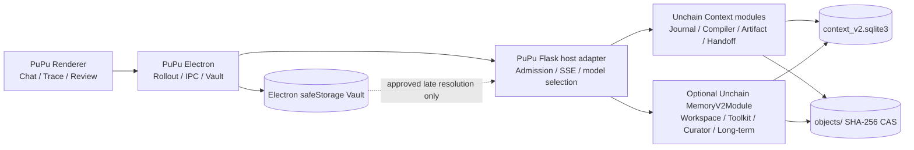

# Memory V2 / Context V2 Claude 接手文档

> 更新时间：2026-08-07  
> 交接范围：PuPu + sibling `unchain` 仓库  
> 文档目的：让接手者不需要重新推导架构，能够直接从当前真实状态继续实现和验收。

> **SUPERSEDED CONTROL NOTICE（2026-08-14）：** 本文保留 2026-08-07 的交接快照与事故考古价值，但其中所有 capability lock、exact SHA、dev bypass、lock/HEAD 对齐和 pinned-pair 操作指引均已失效，不能作为当前运行或发布规则。现行 runtime compatibility/admission 只认实际 import 的 Unchain runtime 导出的 strict protocol manifest；发布连续性由一次构建后全程复用的 wheel SHA-256 + manifest digest 证明；Git revision/source 仅为遥测。当前操作应以现行协议登记表与发布门为准。

## 1. 一页结论

Memory V2 已经不再只是设计稿。Unchain 侧的五层核心、可选 Memory module、无角色 capability grant、系统 Toolkit、Curator、Workspace、长期记忆和持久化都已经实现；PuPu 侧也已经完成 active/shadow host 接线、Context V2 控制面、Trace、候选审核、promotion、Vault 和 rollout 闸门。

但它还不能被描述为“产品完整交付”：

1. 目前只做过一次真实的新会话 active-path 成功验证；那次没有产生 candidate、正式 entry 或长期 promotion，因此**尚未证明跨会话长期记忆的完整闭环**。
2. 右键 `Inspect Memory` 仍然读取 V1/Qdrant 投影。V2 Workspace、candidate、artifact 和 Pinned Task State 目前没有对应的 Inspector。
3. PuPu active host 尚未启用 Unchain 的 exact durable provider request lease/result reuse。工具副作用已具备 durable 保护，但进程崩溃边界仍可能重复一次模型请求和费用。
4. 完整 packaged/canary、跨 provider、normal/graph/resume/subagent、重启恢复和性能矩阵尚未完成最终验收。
5. PuPu 里旧的 toolkit/curator/workspace fallback 文件仍存在；official active path 已经绕开它们，但还没有做物理清理。

因此，当前最准确的判断是：**地基和生产 active 接线已经完成，产品闭环与 rollout 收尾尚未完成。**

### 主观完成度快照

这些百分比表示工程交付成熟度，不表示工程师时间：

| 范围 | 完成度 | 说明 |
| --- | ---: | --- |
| Unchain 五层 library core 与可选模块 | 95% | 实现和全量测试均完成；具体 Curator model invoker、module attachment 和 admission 由 host 提供 |
| PuPu active/shadow 宿主接线 | 85% | normal/graph/resume/subagent 已接入；仍缺 exact provider-turn recovery 和最终矩阵 |
| Memory 写入、整理、提升、召回闭环 | 55% | 代码与 API 存在，但真实 candidate → curator → promotion → 新会话 recall 尚未实测闭环 |
| UI / Trace / Inspector | 65% | Trace、review、promotion 已有；V2 Inspect/Explorer 和 Task State 读取缺失 |
| Vault | 80% | 控制面、受控 sink 和测试已完成；仍需纳入最终产品矩阵 |
| Canary / 生产 rollout | 25% | dev 以 `all` 运行；正式 shadow/canary 指标和 packaged 验收未完成 |
| **原始 Memory V2 P0 总体** | **约 70%** | 核心代码成熟度高，产品验收与发布成熟度明显低于核心代码 |

## 2. 当前仓库锚点

### PuPu

- 路径：`/Users/red/Desktop/GITRepo/PuPu`
- 分支：`dev`
- 当前 HEAD：`cd56dc0f0c4f88d216e595aab3cd0a34bc1cd739`
- 与 `origin/dev` 一致；创建本文档前的交接审计快照中工作树干净
- Memory V2 P0 主提交：`0dc333dcd79b7325593157c0598f123c182aaccd`
- Unchain capability lock 同步提交：`82a609db62ed75c64f62d0ff29823c065cc5f72c`

### Unchain

- 路径：`/Users/red/Desktop/GITRepo/unchain`
- 分支：`dev`
- 当前 HEAD：`a4e69f413c449c5768433ba4dddc5b60b8146991`
- 与 `origin/dev` 一致，交接审计时工作树干净
- Memory V2 P0 基础提交：`f3e9590f31b1e3bd9bbe85fa43f02af5d3960365`
- Module 解耦、无角色权限与 proposal policy：`a4e69f413c449c5768433ba4dddc5b60b8146991`

PuPu 的锁文件 `unchain_runtime/unchain-core.lock.json` 当前精确锁定上述 Unchain SHA，contract version 为 `1`。Packaged/production admission 使用这个精确握手并 fail closed；不允许因为不匹配而静默回落 V1。开发环境另有显式、可审计的 dev-only bypass，当前 `start:electron` 设置了 `PUPU_MEMORY_V2_ALLOW_DIRTY_UNCHAIN_ACTIVE_DEV=1`；它不能进入 packaged release，也不能被描述成 production 接受任意 revision。

### Memory 工作树收敛情况

用户要求所有当前 Memory 改动进入 `dev`，不要留在 worktree。交接前已经完成收敛：

- 删除已经合并且干净的 PuPu/Unchain Memory worktree；
- 删除过时的 Runtime Events V4 prototype worktree。该 prototype 比当前 `dev` 落后约 500 commits，仍走旧 `/chat/stream/v3`，不能合并；
- 删除只剩 package-lock drift 的旧 P3 worktree；
- 保留与 Memory 无关的其他活跃 worktree，不做越权清理；
- 当前没有待合并的 Memory 专用 worktree，接手者应以两个仓库的 `dev` 为唯一代码基线。

为防误删后无法追溯，过时内容只保留为离线 patch：

- `/var/tmp/pupu-runtime-events-v4-superseded-20260807.patch`，SHA-256 `a892a7acbaac9ae4a184b14fc63d5a275917daa55165842b2f6b2917f9f52bb3`
- `/var/tmp/pupu-p3-lock-drift-20260807.patch`，SHA-256 `516d34ff4143d9c8ffc49cbe33664560ca0b9886ca10fdc7d167ef29d86e1437`

这些 patch 是审计备份，不是待合并功能。

创建本交接文档期间，另一个并发进程修改了以下三个 growth-ops note；它们不属于 Memory V2，也不是本次交接编辑，后续 staging/commit 时不要顺手带入：

- `.claude/agent-memory/pupu-growth-ops/exposure-ceiling-channels.md`
- `.claude/agent-memory/pupu-growth-ops/install-signal-2026-06.md`
- `.claude/agent-memory/pupu-growth-ops/silent-downloader-gap.md`

## 3. 已锁定的架构共识

以下不是待讨论选项，而是本轮已经确认并落代码的原则。接手时不要重新引入相反设计。

### 3.1 五层共享一个数据平面

Memory V2 是五个纵向能力，不是五套互相同步的记忆系统：

1. Canonical Execution Journal
2. Context Compiler
3. Artifact & Handoff Store
4. Chat Memory Workspace + Pinned Task State
5. Namespaced Long-term Memory

Secret Vault 是横跨这些层的安全能力，但不属于模型历史，也不算第六层。

“共享一个数据平面”是 PuPu host assembly 必须维持并校验的 invariant，不是 Unchain 类型系统在任意错误组装下都能自动保证的全局属性。Context store、Memory store 和 CAS 必须指向同一个 owner-bound root；新增 host/factory 时必须继续验证 DB/CAS 路径，避免 split-brain。

### 3.2 代码所有权

- Unchain 拥有：Journal、Context Compiler、Artifact/Handoff、Workspace、Pinned Task State、Curator、Memory Toolkit、Long-term persistence、可选 Memory module。
- PuPu 拥有：产品 admission/rollout、Electron 生命周期、Flask host adapter、IPC/preload、UI/Trace、用户确认面、Vault 和产品级模型选择。

PuPu 的 `unchain_runtime/server/` 是宿主适配层，不是 Unchain core 的镜像。它可以绑定、投影和运输 Unchain 能力，但不应再次拥有 compiler、workspace 或 toolkit 的第二套业务真相。

### 3.3 Memory 不是 Agent Builder 里的 Agent

- Agent Builder 中不展示 `Memory Agent` 卡片。
- 不增加 `Memory Adapter` recipe 节点。
- `Active Graph Interaction Resume.recipe` 已删除，不是 Agent。
- Memory 是可选的 Unchain module；宿主可挂载，也可完全不挂载。
- 内部仍有少量 `MemoryAgentHostAdapter`、`memory_agent_settings.js` 和 “Memory Agent” 文案。这些代表系统 Curator 模型调用 seam 或命名债务，不代表一个可被用户添加的 Agent。

### 3.4 Unchain 主 runtime 不强绑定 Memory

`Agent` 默认 `modules=()`。不挂载 `MemoryV2Module` 时，主 runtime 不执行任何 Memory 逻辑，也不会出现 Memory 工具。

Memory module 位于 `src/unchain/memory/module.py`，而不是主 Agent runtime 内。系统 Toolkit 没有 `toolkit.toml`，不是公开 recipe Toolkit，也不出现在普通 Toolkit 商店或 Builder UI。

Unchain 只定义 `MemoryAgentModelInvoker` protocol，不内置具体 provider/model 调用器，也不会自动实例化或开启 `MemoryV2Module`。PuPu 必须在 admission 后显式 attachment，并注入产品选择的 Curator invoker。这是 Unchain 轻量化边界，不是缺失；但也意味着“Unchain library core 已完成”不能直接等价为“任意 host 已具备生产 Memory 行为”。

### 3.5 权限不使用角色枚举

已经删除 `MemoryV2RunRole` 和按 `main/subagent/curator` 名称推导权限的设计。现在使用通用结构：

- `ExecutionIdentity`：execution、attempt、run 和 lineage 事实
- `ModuleGrant`：capability 集合、可下放子集、可选且不可下放的 authority
- `AgentRuntimeContext`：identity + 任意 module grants

父子代理共享同一个底层 Memory host/store，但**不共享相同修改权限**。每次 execution 获得独立 grant；子代理只能继承 delegable capabilities 的子集，completion authority 不会下放。

因此，在“child 沿父级派生、共享同一个 module/host/store、能力仍落在现有 vocabulary 内”的前提下，未来新增 swarm、supervisor 或其他合作拓扑时，不需要修改 Memory 角色枚举；宿主只需发放合适 grant，或在 subagent template 中声明所需 module capability 子集。独立 peer host、跨 store peer 或新增 capability 仍可能需要扩展 module/host contract，但也不应改回角色授权。

另有一条容易混淆的兼容边界：Unchain 仍保留 Legacy `MemoryModule(name="memory")`，`SubagentTemplate.memory_policy` 的 `ephemeral/scoped_persistent` 只控制这个 legacy module key，不控制 `memory_v2`。V2 权限只能从 `ModuleGrant` / `module_capabilities` 判断；不要修改 legacy `memory_policy` 后就误以为已经限制了 V2。

### 3.6 长期记忆永远需要用户确认

普通 Agent 只能创建 candidate。Curator 可以把无冲突 candidate 写成 chat entry，或为冲突生成 review diff；长期记忆必须经过 PromotionProposal 和用户确认。不得把模型调用成功、candidate 创建成功或 curator job 成功误报为“长期记忆已经保存”。

### 3.7 安全 scope 已锁死

Unchain 不在同一个 Python 进程内提供 capability 隔离。信任边界是进程、IPC/网络和磁盘；已经进入同一 Python 进程的任意代码属于同一个 TCB。不要再次启动基于 private attribute、monkeypatch、closure mutation 等同进程攻击面的无限审查线。

只有以下问题可以打断当前 P0 顺序：

1. 必要功能无法正确实现；
2. durable 数据损坏或不可恢复丢失；
3. 明文 secret 离开批准的 late-resolution sink；
4. 工具或 provider 产生重复的外部副作用。

其他优化和 defense-in-depth 进入 backlog，不扩大当前 scope。

## 4. 当前总体架构



一次 active run 的主流程是：

1. PuPu 根据 build ceiling、sidecar ceiling、rollout mode、sticky chat admission 和 capability lock 决定是否进入 V2。
2. host 为本次 execution 建立 `ExecutionIdentity` 和显式 `ModuleGrant`，并挂载 Unchain Context/Memory modules。
3. 语义事件先持久化，再对 UI/SSE 可见或继续执行模型/工具。
4. Context Compiler 从 canonical journal、Pinned Task State、artifact/handoff refs 和当前输入统一编译模型上下文。
5. 工具和子代理完整结果先进入 durable store；上下文只按预算放完整内容或 envelope/ref。
6. 根 run 完成时，如果没有 candidate，不创建 consolidation job，也不调用 Curator 模型。
7. 有 candidate 时，durable Curator job 由 PuPu worker 在 root run 的 after-run lifecycle 中调用 `process_next` 处理，写入 chat entry 或生成冲突 review；它当前不是独立 daemon，也不得递归启动另一个 Curator。
8. Chat entry 只有在用户确认 promotion 后，才派生新的 namespaced long-term revision。
9. 新 chat 首条消息可以检索 long-term memory；召回内容作为不可信引用内容进入 context，不进入 system/developer prompt。

## 5. 五层实现状态

### Layer 1：Canonical Execution Journal — 核心完成

Unchain 生产实现位于：

- `src/unchain/journal/`
- `src/unchain/persistence/sqlite_v2.py`
- `src/unchain/context/projector.py`

已经具备：

- execution/generation/attempt/event 的 durable 语义历史；
- operation ID、payload hash、CAS 和 replay receipt；
- 工具 intent/result、interaction、subagent、artifact、assistant final、run terminal 状态；
- durable 写入失败传播和 fail-closed；
- token/reasoning delta 不作为 canonical 语义历史；
- reload projection 与 live Trace 分离。

真实 dev 验证曾产生 1 个 execution、17 个语义事件，说明 live active path 已经写入 official store。

仍需最终验收：断线、重启、cancel、partial attempt 和所有 provider/path 的组合矩阵。

### Layer 2：Context Compiler — 核心与路径接线完成

关键文件：

- `src/unchain/context/compiler.py`
- `src/unchain/context/runtime.py`
- `src/unchain/context/coordinator.py`
- `src/unchain/context/checkpoints.py`
- `src/unchain/context/budget.py`

当前 official active path 已覆盖 normal、graph、resume 和 subagent。V2 不再由 `LastN=8`、额外 `0.40 × context window`、默认 SlidingWindow 和第二次 optimizer 共同裁剪；official active 编译完成后不再进入旧的二次 optimizer。

编译策略已经实现：

- 真实 model window 减 output reserve 和 transport margin；
- 压力线以下保留所有通过资源校验的当前 generation 语义历史；
- 压力线以上先将大型 tool/subagent payload 替换为 envelope/ref；
- 保持 tool call/result 成对；
- 更早的闭合范围生成 deterministic checkpoint；
- journal 原始内容始终可回读。

“完整历史”不表示接受无限输入。Compiler 仍对 semantic history、pending interaction 等设置硬资源上限；超限会 fail closed。窗口足够时不做 Last-N 截断，与单条或整批输入可以绕过资源限制，是两件不同的事。

压力 reducer 也去掉了“每省略一条消息就重建整份 source cursor map”的重复扫描。`test_reducer_complexity_contract.py` 用 200 条消息锁定 cursor-map 构建次数不超过 10 次；这正是之前压力裁剪出现近似立方级放大的一个直接来源。不要在后续 checkpoint 改造中重新引入按候选前缀反复全量映射/重算的实现。

与 front-tier 产品仍有明显差距：

- provider-native cache/prompt-cache 策略还没有完成生产化闭环；
- 极端大量已关闭 human interaction 仍可能把 mandatory semantic envelopes 撑爆，需要扩大 checkpoint 覆盖；
- 长期任务质量仍缺真实长跑评测、压缩质量评测、来源覆盖率和 canary telemetry；
- structured/multimodal generation rebase 尚未进入统一 canonical schema。

### Layer 3：Artifact & Handoff — 核心完成

关键文件：

- `src/unchain/context/artifacts.py`
- `src/unchain/context/handoff.py`
- `src/unchain/context/derived_handoff.py`

已经具备内容寻址对象、分页读取、bounded full read、ArtifactRef、结构化 HandoffEnvelope 和 parent/child 来源绑定。真实 dev run 已创建 4 个 artifacts。

明确的非阻断 crash boundary：如果 child handoff 已持久化，但父 tool completion seal 尚未写入就崩溃，重启会 fail closed，不会重跑 child；完整 child output 仍可读，但暂时不能自动从 handoff receipt 重建父 completion seal。

### Layer 4：Workspace + Pinned Task State — 核心完成，产品闭环未验收

关键文件：

- `src/unchain/memory/workspace/`
- `src/unchain/persistence/sqlite_memory_v2.py`
- `src/unchain/context/task_state.py`
- `src/unchain/context/task_state_runtime.py`
- `src/unchain/memory/toolkit/`

已经实现：

- folder、markdown、image、link；
- stable path/name/description、revision、source refs；
- exact path/name、FTS/BM25 和 lexical/path fallback；
- optional vector-index seam 已实现，但当前 PuPu active host 传入 `vector_index=None`，尚未挂载生产 vector index；
- Pinned Task State 的 objective、success criteria、constraints、decisions、questions、plan 和 refs；
- CAS、revision history、soft archive；
- candidate、consolidation job、conflict review 和 user decision。

当前产品缺口：V2 Workspace Inspector 尚未实现；renderer 也没有 `getTaskState` 读取能力。真实 dev DB 里当前 `entries=0`、`candidates=0`、`jobs=0`，所以代码存在不等于真实写入闭环已经证明。

### Layer 5：Namespaced Long-term Memory — 核心完成，真实跨会话召回未证明

关键文件：

- `src/unchain/persistence/sqlite_long_term_memory_v2.py`
- `src/unchain/persistence/sqlite_promotion_v2.py`
- `src/unchain/memory/workspace/promotions.py`
- `src/unchain/memory/long_term_recall_v2.py`

已经具备 namespace 绑定、PromotionProposal、来源 revision/event refs、用户确认门、long-term revision 和新 chat recall request factory。

Unchain core 的数据模型支持 namespace，但当前 PuPu host 仍固定使用单用户 namespace `user:local`。真正的 user/agent/product namespace resolver 尚未产品化；不要把 core 的 namespace 能力误报为当前 PuPu 已支持多用户或按 Agent 隔离。

尚未完成的关键产品证据：

1. 在 chat A 明确要求记住一个无敏感性的长期事实；
2. 模型调用 `memory_propose`；
3. candidate 被 Curator 处理为 formal chat entry；
4. 用户创建并确认 promotion；
5. chat B 第一条消息召回同一条 long-term entry；
6. UI/Trace/DB provenance 与模型回答一致。

在这六步全部通过前，不能宣称“PuPu 已经开始稳定使用新的长期记忆”。

## 6. Memory module、Toolkit 与 Curator 的实际语义

### 6.1 普通 Agent 可获得的工具

根据本次 `ModuleGrant`，普通 Agent 最多获得：

- `context_content_read`
- `context_checkpoint_events_read`
- `memory_list`
- `memory_search`
- `memory_read`
- `memory_propose`

没有对应 capability 时，工具不会挂载；`memory_propose` 的额外 prompt policy 也不会进入模型提示。

### 6.2 Curator 侧工具

正式 Workspace Curator 额外拥有 upsert、move、link、supersede、archive、history、promotion proposal 和 task-state update。Consolidation worker 只允许读取当前冻结 job 的 candidate/source，并进行 server-bound apply-new 或 propose-review。

模型 callable signature 中没有任意 chat、user 或 namespace 参数。scope、binding、provenance 和 operation ID 均由 host 注入。

### 6.3 什么情况下模型应该提出 Memory candidate

规则版本：`unchain.memory.proposal_policy.v1`  
文件：`src/unchain/memory/toolkit/policy.py`

除用户明确要求“记住、保存、纠正或替换”外，必须同时满足：

1. Evidence：来自用户直接陈述、已确认决定或经过工具/测试验证的结果；
2. Future value：丢失后会明显降低未来行为质量，或迫使用户重复重要信息；
3. Durability：价值超过当前 exchange；
4. Novelty：新增、纠正或实质补充已有知识，而不是重复改写。

高信号内容包括稳定偏好、长期协作规则、确认的项目决定/约束、可复用流程、已经验证的 failure shield、昂贵的环境事实和重要 artifact 引用。

不得提出：secret、猜测、未接受的建议、寒暄、一次性请求、临时状态、当前 plan/open question、原始 transcript/log、隐藏 reasoning 或完整 tool/subagent payload。

当前**没有额外的独立自动分类器**。是否调用 `memory_propose` 仍依赖模型按这份 tool policy 判断。因此后续 E2E 测试必须验证模型真的看到该工具与 policy，而不能只直接调用后端 candidate API。

当前 Context Compiler 创建 checkpoint 时也不会自动制造 Memory candidate。正式 candidate 的来源是实际成功的 `memory_propose` 调用；不要沿用早期计划中“checkpoint 发现可整理内容就自动建 candidate”的假设。

### 6.4 内部命名提醒

PuPu 仍有 `memory_agent_settings.js`、`memory_v2_unchain_agent_factory.py` 等命名，用于选择和调用系统 Curator 模型。产品决策是把它视为 Memory module/adapter 的内部实现，不在 Builder 中暴露为 Agent。后续可以做命名清理，但不要因此重新增加 UI 卡片或 recipe node。

## 7. PuPu 当前接线状态

### 7.1 Rollout 与 capability lock

关键文件：

- `electron/main/services/unchain/memory_v2_rollout.js`
- `electron/main/services/unchain/service.js`
- `unchain_runtime/server/context_memory_v2_capability.py`
- `unchain_runtime/unchain-core.lock.json`

当前状态：

- build feature 的代码默认仍为 `false`；
- 当前 dev snapshot 的 `enable_memory_v2=true`；
- `package.json` 的 `start:electron` 以 `PUPU_FEATURE_MEMORY_V2=all` 和 `PUPU_MEMORY_V2_MODE=all` 启动；
- admission 是 sticky 的，不允许 V2 chat 在错误时静默回落 V1；
- Windows active 当前被约束到 shadow；
- packaged/production 中 lock revision 不匹配时 readiness fail closed；dev-only bypass 必须显式开启并在 readiness 中可见。

曾经出现过一次真实故障：Unchain 已前进到 `a4e69f4`，PuPu lock 仍指向旧 SHA，导致 UI 报 `Memory V2 capability is unavailable`。`82a609db` 已修正。以后每次 Unchain contract commit 前进，都必须同步更新 lock 并重跑 capability/readiness 测试；不要用 dev bypass 代替 lock 更新。

### 7.2 Active/Shadow host

关键文件：

- `unchain_runtime/server/memory_v2_unchain_active_bridge.py`
- `unchain_runtime/server/memory_v2_unchain_shadow_bridge.py`
- `unchain_runtime/server/memory_v2_unchain_runtime_factory.py`
- `unchain_runtime/server/memory_v2_unchain_run_binding.py`
- `unchain_runtime/server/memory_v2_unchain_runtime_context.py`
- `unchain_runtime/server/unchain_adapter.py`

normal、graph、resume、subagent 已接入 official Unchain module path。Active 路径明确跳过旧 PuPu Memory Toolkit 和二次 optimizer，并有 focused tests 防止 double-write。

Shadow 仍需要保持 V1 authoritative 输入与 V2 journal dry-run 的语义；turn mutation 使用 journal-first、V1-mirror-second 的 durable outbox，避免两套状态不可恢复地漂移。

Edit、resend 和 delete 的 V2 路径不再调用 V1 `replaceSessionMemory`，而是读取 durable session head 后执行 generation rebase。只有 feature flag off，或服务端明确证明该 chat 从未有过任何 V2 状态时，才允许走 Legacy mutation；bootstrap pending、bridge 不可用、revision/generation 不完整或已有 V2 evidence 时全部 fail closed，且在 durable ack 前不改本地历史。这套语义用于修复“resend 时 memory still being prepared”一类会把 V2 chat 错误落回旧记忆系统的问题。

### 7.3 Renderer / Electron Context V2 API

关键文件：

- `unchain_runtime/server/route_memory_v2.py`
- `electron/main/services/unchain/service.js`
- `electron/shared/channels.js`
- `electron/preload/bridges/context_v2_bridge.js`
- `src/SERVICEs/bridges/context_v2_bridge.js`

现有受控能力覆盖：status/events/content/session-head 的只读访问、session rebase、spaces/tree/entries/search/candidates/reviews/jobs/promotions 的列举或读取，以及 candidate、candidate-review、promotion 的受控 decision。Renderer 没有 entry create/update/delete，也没有 consolidation-job create/claim/complete 控制权。

Renderer 不拥有 generic append、任意 URL、任意 namespace、Curator lease 或 plaintext secret read 能力。

### 7.4 Trace 与审核 UI

关键文件：

- `src/SERVICEs/runtime_events/memory_v2_trace_presenter.js`
- `src/COMPONENTs/chat-bubble/memory_v2_journal_reload.js`
- `src/COMPONENTs/chat-bubble/memory_v2_trace_audit.js`
- `src/COMPONENTs/chat-bubble/memory_v2_pending_reviews.js`
- `src/COMPONENTs/chat-bubble/trace_chain.js`

已经支持 Complete/Partial/Legacy/Unavailable、context pressure、checkpoint/artifact/handoff ref、折叠 Curator 子树、journal reload、candidate/review/promotion 状态和 user decision。Review UI 只允许用户决定 server-frozen diff，不允许 renderer 同时 propose 和 approve。

### 7.5 Agent Builder 当前是正确状态

- 没有 Memory Agent/System Agent 卡片；
- 没有 Memory Adapter 节点；
- `Active Graph Interaction Resume.recipe` 已删除；
- 本机审计快照中的系统 recipe 是 Default 和 Explore；用户目录仍可有其他 recipe；
- `workflow_list.test.js` 锁定“不显示 Memory Agent/System Agent 卡片”，但不证明所有安装中永远只有两份 recipe，也不负责验证磁盘上的 Active Graph recipe 删除。

不要把缺少 Memory 卡片当成 bug。

## 8. 当前最大的 UI 缺口：Inspect Memory 仍是 V1

当前右键 `Inspect Memory` 的完整链路仍是：

`side_menu_context_menu_items.js` → `memory_inspect_modal.js` → legacy `getMemoryProjection(sessionId)` → `/memory/projection` → `route_projection.py` → Qdrant/PCA + V1 profile JSON。

Memory V2 不写 V1 short-term Qdrant vectors，所以：

- Legacy chat：旧 Inspector 仍可工作；
- V2 chat：通常只显示空向量/没有数据；
- 即使 V2 已经有 Workspace entry，旧 Inspector 也看不到；
- Pinned Task State 当前也没有 renderer 读取 API。

正确的下一步不是删除整个入口，而是保留一个用户可理解的 `Inspect Memory` 动作，并根据 chat admission 分流：

1. Legacy chat → 继续使用现有 PCA modal；
2. V2 chat → 使用新的 Workspace Inspector，读取 `contextV2API` 的 spaces/tree/entries/search/candidates/jobs/promotions/content；
3. 如果要显示 Pinned Task State，补一个严格 scope-bound、只读的 `getTaskState` 四层契约：Flask route → Electron service/IPC → preload → renderer bridge；
4. 不要把 V2 Inspector 重新实现成一个向量图。P0 首先需要可验证的 tree、entry、revision、provenance、candidate 和 task-state 视图；完整 Explorer/vector visualization 仍是后续项。

## 9. Vault 状态

Vault 位于 Electron 信任边界，使用 `safeStorage`，不属于 Unchain Memory module。

关键文件：

- `electron/main/services/memory_vault/`
- `electron/preload/bridges/memory_vault_bridge.js`
- `src/SERVICEs/bridges/memory_vault_bridge.js`
- `src/PAGEs/chat/hooks/secret_capture.js`
- `src/PAGEs/chat/hooks/use_secret_capture_gate.js`
- `unchain_runtime/server/vault_sink_*`

当前约束：

- renderer 没有 read/resolve/decrypt plaintext IPC；
- 对于已经被捕获、且用户确认存入 Vault 的 secret，模型、journal、Trace 和日志只看到 opaque handle；
- late resolution 只允许 computer input、shell secret env/stdin、`x-pupu-secret` MCP 参数；
- secret 不得插入 shell command 字符串或普通工具参数；
- safeStorage 不可用时 fail closed；
- scope 默认绑定 chat，global scope 需要显式操作；
- Memory Curator 不读取或提升已经进入 Vault 的 secret 明文。

用户可以拒绝启发式捕获并按普通聊天内容发送，启发式也不可能保证识别所有秘密。因此安全验收必须区分“已确认进入 Vault 的 secret”与“用户明确选择按普通消息发送的文本”，不能把 opaque-handle 保证外推到所有可能长得像凭据的字符串。

Vault focused JS 74 tests 和 Python 66 tests 在本次交接核对中通过。它仍需要与最终 active/canary/provider 测试矩阵一起验收。

## 10. Durable 存储与当前真实数据

PuPu dev 的 official store：

- DB：`~/Library/Application Support/PuPu/memory_v2/context_v2.sqlite3`
- CAS：`~/Library/Application Support/PuPu/memory_v2/objects/`
- owner marker：`context_v2.owner.json`
- 当前 marker：`owner=unchain`

2026-08-07 交接时，以 immutable SQLite 读取当前本机数据：

| 表 | 行数 |
| --- | ---: |
| executions | 1 |
| events | 17 |
| spaces | 2 |
| entries | 0 |
| artifacts | 4 |
| candidates | 0 |
| consolidation_jobs | 0 |
| promotion_proposals | 0 |

这组数据能证明 journal、space bootstrap 和 artifact path 已经真实工作；它不能证明 Memory candidate、formal entry、promotion 或 cross-chat recall 已工作。

应用运行时普通 read-only SQLite 连接可能因为 WAL/权限边界无法打开。诊断时可以使用 immutable URI，但只能用于快照观察，不能用它做在线一致性判断或任何写入：

```bash
sqlite3 'file:/Users/red/Library/Application%20Support/PuPu/memory_v2/context_v2.sqlite3?immutable=1' ".tables"
```

## 11. 本次交接时的验证证据

### Unchain

当前 `a4e69f4`：

- 全量：`2824 passed, 2 skipped, 5 xfailed in 41.38s`
- 本次主交接进程执行 6 个 module/grant/toolkit 文件：`64 passed`（`test_memory_v2_agent_module.py`、`test_subagent_memory_v2_binding.py`、`test_memory_toolkit_contract.py`、`test_agent_module_propagation.py`、`test_agent_runtime_context_binding.py`、`test_module_runtime_context.py`）
- 独立审计进程把 `test_memory_agent_host.py` 一并纳入后执行：`72 passed`
- 本次主交接进程执行 6 个 compiler/journal/artifact/handoff/recall 文件：`104 passed`（`test_compiler_golden_contract.py`、`test_context_path_parity.py`、`test_durable_event_sink.py`、`test_artifact_handoff.py`、`test_subagent_production_handoff.py`、`test_long_term_recall_v2.py`）

全量由只读审计 agent 在当前 HEAD 实际执行，测试后仓库保持干净。

### PuPu Python sidecar

Capability/readiness/routes focused：

```text
49 passed, 3 subtests passed
```

另有 normal/resume/graph/interaction-resume/restart/agent-mount/runtime-context focused：`24 passed`。

### PuPu React / Electron

- Context bridge、Agent Builder 状态、Memory V2 Trace：3 suites / 28 tests 通过；
- Electron context service、rollout、preload bridge：3 suites / 45 tests 通过；
- Vault renderer/Electron focused：4 suites / 74 tests 通过。

Electron `.cjs` 测试不要用 `node --test` 直接运行；它们使用 Jest globals。当前最可靠的 focused 调用是运行 `src/electron/tests/**.test.js` 对称 wrapper。

### 真实 app 验证

曾用本地 Ollama `deepseek-r1:14b` 创建一个新 chat，询问是否能召回有来源的长期记忆。修正 capability lock 后，run 成功并显示：

- `Memory V2 · Complete`
- `Active`
- 4,064 input / 339 output tokens
- 约 59.8 秒完成

模型正确回答“没有召回到长期记忆”。这证明 active normal run 可工作，也与当前 `entries=0` 一致；它不是跨会话 recall 的正向证据。

## 12. 已知技术债与非阻断 backlog

这些问题已经记录，不应在当前闭环任务中无限扩展 scope：

### Unchain 已记录

- handoff 已 durable、父 tool completion 未 seal 时不能自动恢复 seal；
- first attachment 与 chat deletion 尚无同一 owner-scoped transaction；
- 极端大量 closed interaction 需要更广的 deterministic checkpoint；
- 并发 durable tool consumer 的 receipt publication 偶有可见性竞态，但没有重复 handler effect；
- promotion decision reason 尚未作为 durable provenance 保存；
- folder description-only update 缺 official operation；
- generation rebase 只保留 string user/assistant content，不保留 structured/multimodal content；
- durable provider stream callbacks 当前是 at-most-once：崩溃后可以恢复 final result，但不会重放已经产生的 token/reasoning delta；
- durable graph/resume snapshot 目前要求 completion capability 携带非空 authority，但尚未独立重算 host 的 deterministic authority；在当前 process+disk 信任边界内是非阻断项，若 snapshot 将来可被 client import，必须重新评估 provenance；
- `run_tests.sh` 仍引用旧包名，应直接使用 `.venv/bin/python -m pytest`；
- proposal policy 是固定 prompt 成本，后续可在不改变语义的前提下压缩；
- 少量内部 “role” 或 “Memory Agent” 文案仍是命名债务，不是权限机制。

详见 sibling Unchain：

- `docs/context-memory-v2-p0-followups.md`
- `docs/context-memory-v2-provider-compatibility-backlog.md`
- `docs/context-memory-v2-security-backlog.md`

### PuPu 已记录

- review display scrubber 对恰好跨页分割的 host-path 形状缺 overlap window；
- 部分 content read 错误会被 route 归一成 500，而不是更精确的 400/404；
- rollout mode 降到 off 后，已有 sticky V2 chat 需要 manifest-aware read-only continuity；
- session-head GET 的 cold-open path 仍可能验证/初始化 schema，应有严格 read-only projection；
- `memory_v2_unchain_ownership_adapter.py` 顶部仍有“production gate closed”旧注释；
- `docs/architecture/memory-system.md` 主要描述 V1，需要后续更新；
- GitNexus index 在本次审计时落后于 HEAD，增量 analyze 又遇到 `file_fts` inconsistency。Claude 若依赖最新图，应先 clean/rebuild index，不要把旧图当当前代码事实。

详见：`docs/architecture/memory-v2-p0-followups.md`。

## 13. PuPu 旧实现清理状态

以下旧/兼容文件仍在 PuPu：

- `unchain_runtime/server/memory_v2_toolkit.py`
- `unchain_runtime/server/memory_v2_curator.py`
- `unchain_runtime/server/memory_v2_workspace_adapter.py`
- `unchain_runtime/server/memory_v2_context_adapter.py`
- `unchain_runtime/server/unchain_adapter.py` 中的 legacy fallback 构建路径

official active 在 `unchain_adapter.py` 中明确跳过旧 toolkit/optimizer，并有 active tests 把 fallback 调用设为 forbidden。因此“生产 active 所有权切到 Unchain”已完成，但“物理删除 PuPu 旧实现”未完成。

不要立即整批删除。正确顺序是：

1. 先完成 V2 product E2E 和 shadow/canary；
2. 用 usage/impact 分析区分 active、shadow、legacy、fixture/export 调用；
3. 逐个删除不可达路径，同时保持 Legacy V1 chat 可读；
4. 每个 symbol 删除前做 GitNexus upstream impact；HIGH/CRITICAL 先报告；
5. 重跑 active + shadow + legacy bootstrap + migration + route tests；
6. 最后更新 V1/V2 架构文档。

## 14. Claude 接手后的建议执行顺序

### P0-1：修复 Inspect Memory 语义

目标：用户打开 V2 chat 的 `Inspect Memory` 时，看到真实 V2 Workspace 状态，而不是 V1 空向量。

最小交付：

- V1/V2 admission 分流；
- V2 tree/entries/candidates/jobs/promotions 的分页只读视图；artifact 先从 journal/entry/handoff 已披露 refs 打开，若产品确实需要独立浏览再新增 scope-bound `listArtifacts` 契约（现有 bridge 没有该列表接口）；
- 增加严格 scope-bound `getTaskState` 读取契约；
- empty state 明确区分“V2 正常但尚无 entry”和“V2 unavailable/partial”；
- focused React + Electron + Flask route tests；
- 不做完整 vector visualization。

### P0-2：完成真实 Memory 闭环

使用无敏感性测试事实，例如“以后这个项目的交接文档默认用中文”：

1. chat A 明确要求记住；
2. 验证模型看到 `memory_propose` policy 并创建 candidate；
3. 验证 root completion 只在有 candidate 时 enqueue job；
4. 验证 Curator 创建 chat entry 或 review；
5. 创建 PromotionProposal；
6. 通过 UI 明确确认；
7. chat B 首条消息正向召回；
8. 对照 Trace、API、DB revision/provenance；
9. 增加一条 secret 负例和一条 duplicate 负例。

完成后才可把“new memory 已可使用”写入用户说明。

### P0-3：启用 exact durable provider-turn recovery

在 PuPu active factory 中显式启用 Unchain `provider_turns_enabled`，然后补齐：

- normal / graph / resume / subagent；
- OpenAI / Anthropic-family / Ollama-compatible；
- provider response 已落盘、回调未完成时的 restart；
- request lease CAS、result reuse 和费用不重复；
- tool side-effect exactly-once 不回退。

这是 provider I/O / execution durability 距离 front-tier 产品的最大剩余差距之一；它不是 Context Compiler 的职责，不要为了启用 lease/result reuse 去改 compiler 的输入选择语义。

### P0-4：跑完整发布矩阵和 canary

- Shadow：只改变 journal/dry-run，不改变 Legacy 模型输入；
- Canary 5% / 48h；
- Canary 25% / 72h；
- 检查 fatal rate、orphan tool pair、重复 effect、Trace reload p95、first-token p95、vector-off fallback 和 Vault 明文泄漏；
- packaged Electron 与 dev Electron 分开验收；
- sidecar crash、app crash、断线、cancel、pause/resume、rebase、delete outbox 全覆盖。

### P0-5：最后清理旧 PuPu 实现与文档

只有 P0-2 到 P0-4 通过后，才删除 official active 已不使用的 PuPu compiler/curator/workspace/toolkit fallback，更新 `memory-system.md`，并收紧 build default/rollout 配置。

## 15. 接手运行手册

### 15.1 先确认版本握手

```bash
cd /Users/red/Desktop/GITRepo/unchain
git status --short --branch
git rev-parse HEAD

cd /Users/red/Desktop/GITRepo/PuPu
git status --short --branch
cat unchain_runtime/unchain-core.lock.json
```

正常交付和 packaged 验收时，Unchain HEAD 与 lock revision 必须一致。显式 dev-only bypass 只用于本地开发且必须可审计，不能代替更新 lock。修改任何 Unchain Python 后，PuPu sidecar 必须重启才能进行集成验证。

### 15.2 启动当前 dev active 模式

```bash
cd /Users/red/Desktop/GITRepo/PuPu
npm start
```

`start:electron` 当前会设置 Memory V2 `all/all`。不要据此推断 packaged release 默认已打开；build feature 的代码默认仍为 false。

### 15.3 Unchain 测试

`run_tests.sh` 当前有旧包名问题，直接运行：

```bash
cd /Users/red/Desktop/GITRepo/unchain
.venv/bin/python -m pytest -q tests
```

### 15.4 PuPu sidecar focused

```bash
cd /Users/red/Desktop/GITRepo/PuPu/unchain_runtime/server
PYTHONPATH=/Users/red/Desktop/GITRepo/unchain/src \
  ../../.venv/bin/python -m pytest -q \
  tests/test_context_memory_v2_capability.py \
  tests/test_memory_v2_capability_admission.py \
  tests/test_runtime_contract_health.py \
  tests/test_route_memory_v2.py
```

### 15.5 React / Electron focused

```bash
cd /Users/red/Desktop/GITRepo/PuPu
CI=true npx react-scripts test --watchAll=false --runTestsByPath \
  src/COMPONENTs/agents/pages/recipes_page/workflow_list.test.js \
  src/SERVICEs/bridges/context_v2_bridge.test.js \
  src/COMPONENTs/chat-bubble/trace_chain.memory_v2.test.js

CI=true npx react-scripts test --watchAll=false --runTestsByPath \
  src/electron/tests/main/context_v2_service.test.js \
  src/electron/tests/main/memory_v2_rollout.test.js \
  src/electron/tests/preload/context_v2_bridge.test.js
```

### 15.6 每次代码变更的项目约束

- 修改 symbol 前先做 GitNexus upstream impact；
- HIGH/CRITICAL 先报告再继续；
- Python 修改后重启 sidecar；
- Electron `.js/.cjs` 对称测试保持同步；
- 交付前运行 `detect_changes(scope="compare", base_ref="main")`；
- 不因 V2 错误静默 fallback V1；
- 不提交 secret、host path 或 plaintext diagnostic；
- 默认不替 CEO 创建 git commit，除非得到明确指令。

## 16. 不要重复做或不要推翻的事项

- 不要重新创建 Memory Agent 卡片或 Memory Adapter recipe node。
- 不要把 Memory module 放进 `Agent` 默认 modules。
- 不要恢复 `MemoryV2RunRole` 或任何按 main/subagent 名称授权的枚举。
- 不要让模型传入 chat、user、namespace 或任意 host path。
- 不要让普通 Agent 直接 upsert formal memory 或自动写 long-term。
- 不要把 long-term recall 拼入 system/developer prompt。
- 不要把 tool/subagent 完整结果重新塞回一次性交接文本；使用 durable ref。
- 不要重新启用 V2 的 LastN、0.40 window 或第二次 SlidingWindow。
- 不要把 Inspect Memory 的 V1 空结果解释为 V2 没有工作；先按 admission 分流。
- 不要把一次 `memory_propose` 成功描述为“记忆已保存”。
- 不要重新打开 Python 同进程 capability 隔离审查线。
- 不要在跨会话正向闭环完成前宣布 Memory V2 产品已经完成。

## 17. 下一里程碑的 Definition of Done

Claude 接手后的下一个可对用户宣布的里程碑，应同时满足：

1. V2 `Inspect Memory` 展示真实 Workspace、candidate、entry、revision、provenance 和 Pinned Task State；
2. 一条无敏感性事实完成 candidate → Curator → formal chat entry → user-confirmed promotion → 新 chat recall；
3. 一条 secret 被 Vault 捕获且永不进入 journal/Trace/memory；
4. normal、graph、resume、subagent 在 OpenAI、Anthropic-family、Ollama-compatible 上通过 focused matrix；
5. restart 不重复 tool side effect，exact provider result recovery 已启用并验证；
6. Legacy chat 仍可读取，V2 chat 错误时 fail closed；
7. Trace live/reload 一致，引用可以分页读取；
8. focused/full tests 通过，GitNexus change scope 与预期一致；
9. shadow/canary 指标达到原 P0 门槛；
10. 最后再移除不可达的 PuPu 旧 toolkit/curator/workspace fallback。

达到这些条件后，Memory V2 才从“强地基 + active 接线”进入“可对用户承诺的完整产品能力”。
