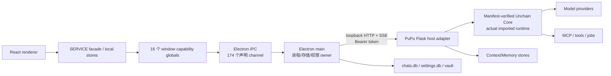
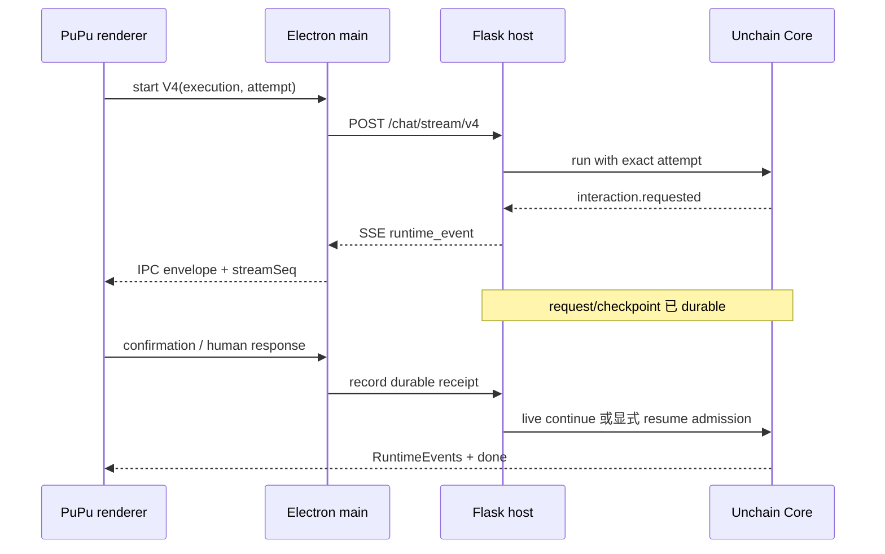

# PuPu / Unchain 协议全景与契约登记表

> 状态：当前协议总索引（architecture registry）
> 最近核对：2026-08-14
> PuPu / Unchain Git revision、source path 与 dirty 状态：仅作审计遥测，不是兼容准入条件
> Runtime compatibility：实际 import 的 Unchain module 导出的 `unchain.runtime_protocol_manifest.v1`
> Release continuity：一次构建并全程复用的 wheel SHA-256 + runtime manifest digest

本文回答三个问题：PuPu 自己内部有哪些稳定协议、PuPu 与 Unchain 之间如何通信、实际运行与发布候选中的 Unchain Core 内部有哪些协议。它是**协议导航和变更登记表**，不是把每个字段重复抄一遍的 API 手册；字段级真相仍以生产者、消费者、验证器和契约测试为准。

## 1. 结论先行

本次按“存在跨模块、跨进程、序列化、持久化、幂等或稳定状态机边界”统计。普通同进程函数调用不算协议；一个协议族可以包含多个 versioned schema。

| 范围 | 顶层协议族 | 说明 |
|---|---:|---|
| PuPu 内部 | 22 | Renderer、preload、Electron main、本地数据库、outbox、系统能力和测试桥 |
| PuPu ↔ Unchain | 17 | 子进程、HTTP/SSE、鉴权、流式事件、恢复、Context/Memory、Vault 和域 API |
| Unchain 内部 | 19 | Agent/Kernel、journal、Context、tool/provider authority、graph/subagent、jobs 等 |
| **合计** | **58** | 这是本文件采用的“协议族”粒度，不等于 schema 或 endpoint 数量 |

同时存在这些更细的、可机械核对的表面数量：

| 原语 | 数量 | 备注 |
|---|---:|---|
| Electron 共享 IPC channel 常量 | 174 | 14 个 namespace；其中生产实际使用 168 个 distinct channel |
| 生产 `window.*` global | 16 | 其中 14 个 API bridge；另有条件启用的 test bridge |
| Flask 显式 HTTP 路由 | 94 | 12 个 route module；GET 41、POST 42、DELETE 10、PATCH 1 |
| Chat stream route | 3 | V4 默认、V2 fallback、V1 固定拒绝；V3 为 0 |
| RuntimeEvent V4 类型 | 14 | 旧文档写 13，漏了 `interaction.fyi_injected` |
| Context V2 HTTP 路由 | 30 | 18 个 renderer capability、1 个 main-only delete、11 个 internal/worker capability |
| 候选 Core 快照中显式 `unchain.*.vN` schema/domain token | 120 | 此计数是审计快照，不是兼容准入输入；schema 数量不能直接当作协议族数量 |

### 状态词

| 状态 | 含义 |
|---|---|
| `ACTIVE` | 当前生产路径有 producer 和 consumer |
| `ACTIVE-GATED` | 已接线，但要通过 feature、rollout、owner 或 capability admission |
| `COMPAT` | 仍被兼容/回退路径使用，不是首选路径 |
| `REGISTERED` | 路由或能力存在，但不代表当前用户流量已开启 |
| `DISABLED` | 表面保留，但明确拒绝使用 |
| `REMOVED` | 当前实现不存在，仅历史文档/测试语境出现 |
| `TEST-ONLY` | 仅开发或 E2E 测试启用 |
| `UPSTREAM-ONLY` | Core 有能力，但 PuPu 当前 sidecar 没有 mount |

## 2. 真相源和版本边界

这套系统当前有四个必须分开的身份概念：

1. **PuPu host / sidecar snapshot**：`electron/`、`src/` 和 `unchain_runtime/server/` 的当前工作区。当前工作区已有其他未提交变更，所以本文称其为“当前候选快照”，不把它冒充成某个已发布版本。
2. **实际加载的 Runtime Protocol Manifest**：Unchain 的 `unchain.runtime.runtime_protocol.runtime_protocol_manifest()` 从实际 import 的代码导出 `unchain.runtime_protocol_manifest.v1`。PuPu sidecar 与 Electron 各自严格校验 schema、closed key set、NFC/UTF-8 canonical ordering、safe integer、manifest digest、major/minor 与 required feature set；这才是 runtime compatibility/admission 的唯一权威。
3. **不可变 release artifact**：选定 source 只构建一次 wheel。contract matrix、package smoke 与 release report 必须消费同一个文件并核对同一 wheel SHA-256 与同一 manifest digest；任一阶段重新从 source 构建，都不再是同一个 deployed artifact 的证据。
4. **source provenance telemetry**：Git ref/revision、source path 与 dirty 状态可以记录在 artifact evidence 或 status 中，帮助追溯来源；它们不能授予 capability，不能改变 admission 结论，也不能替代 manifest/artifact identity。

权威优先级：

1. 实际 import runtime 导出的 manifest + PuPu sidecar/Electron 的独立 strict validator；
2. 同一个 wheel SHA-256 + manifest digest 贯穿 contract/package/release 的 artifact continuity evidence；
3. 真实 producer → strict consumer 的两侧契约测试与跨进程测试；
4. 本登记表与专题说明文档；
5. Git/source telemetry、mutable sibling checkout、注释或设计草案。

没有使用同一 wheel artifact 运行完整 contract/package matrix 时，只能说“runtime manifest 已静态核对”，不能声称该发布 artifact 已获发布认证。

### 2.1 Runtime protocol manifest v1

Manifest 顶层是 CLOSED shape：`{manifest_digest, protocols, runtime, schema}`；每个 protocol 也是 CLOSED shape：`{features, id, major, minor}`。`schema` 固定 `unchain.runtime_protocol_manifest.v1`，`runtime` 固定 `unchain`。字符串必须 NFC，protocol ID 与 feature 必须按 UTF-8 byte order 排序且唯一；版本必须是 `0..2^53-1` 的整数，bool 明确不算整数。Digest 是对不含 `manifest_digest` 的 canonical JSON 计算 SHA-256，domain separator 是字面 UTF-8 bytes `unchain.runtime_protocol_manifest.v1\\u0000`，不是 NUL 字节。

当前 required protocol matrix：

| Protocol | Version | Required features |
|---|---:|---|
| `context_memory` | `1.0+` | `artifact_handoff`, `canonical_journal`, `context_compiler`, `interaction_resolution_compat`, `long_term_promotion`, `memory_curator`, `memory_toolkit`, `memory_workspace` |
| `durable_interaction` | `1.0+` | `cancel_pending`, `expected_interaction_id_cas`, `fresh_run_lineage`, `host_controlled_resume` |
| `provider_turn_ownership` | `1.0+` | `atomic_receipt_cas`, `auxiliary_calls`, `enforce_mode`, `graph_runs`, `memory_off`, `subagent_runs` |
| `run_bundle` | `1.0+` | `canonical_metrics`, `completion_diagnostics_ref`, `continuation_claim`, `immutable_pricing_snapshot`, `provider_call_set_union`, `provider_call_usage_v1`, `run_bundle_v1` |

Sidecar 内部 status wire 固定使用：`runtime_protocol_ready`、`runtime_protocol_reason`、`runtime_protocol_verification`、`runtime_protocol_immutable`、`runtime_protocol_manifest`、`unchain_revision`、`unchain_runtime_source`。成功态是 `true / unchain_runtime_protocol_compatible / runtime_protocol / true / <full manifest>`；off 态是 `true / protocol_not_required / not_required / false / null`。Electron 在 main 内独立重算并消费完整 manifest，对 renderer 的一般状态投影只披露 digest/verification，不披露 source path 或完整 manifest。revision/source 两项在所有状态都只是遥测；consumer 不能从它们推导 ready。

### 2.2 Release artifact continuity

Release pipeline 从选定 source 构建一个 wheel，记录 wheel filename、byte size、`sha256:<64 hex>`、完整 runtime manifest 与 manifest digest。之后 contract matrix、Linux/macOS/Windows package build、真实 sidecar smoke 与 final report 都下载并消费这一个 artifact；安装后还要从实际 installed distribution 验证 wheel archive hash 与 manifest。Release builder 要求 source clean，是构建可追溯/可复现的 provenance 门；它不参与 runtime compatibility，不是 Git SHA allowlist，也不能把另一次构建冒充为同一 artifact。

## 3. 总体链路



边界责任不是对称的：Renderer 只持 UI 能力；Electron main 持有 OS、数据库、sidecar 进程和 provider secret；Flask host 把 PuPu payload 投影成 Core 能接受的 typed input；Core 持有 agent、execution、journal、tool/provider authority；provider wire 不能倒灌回 canonical journal。

## 4. PuPu 内部协议族（22）

| ID | 协议族 | 状态 | 核心契约 | 权威入口 |
|---|---|---|---|---|
| `PUPU-001` | Renderer SERVICE facade | ACTIVE | React 原则上经 `src/SERVICEs` 调用系统能力；统一 bridge availability、timeout、`FrontendApiError` 和 web/Jest fallback。截图 hook 直接调用 `window.screenshotAPI` 是现存例外 | `src/SERVICEs/api*.js`, `src/SERVICEs/bridges/` |
| `PUPU-002` | Preload capability bridge | ACTIVE | `contextIsolation:true`；具名方法、allowlisted payload、订阅返回 unsubscribe；Renderer 永远拿不到 `ipcRenderer` | `electron/preload/index.js`, `electron/preload/bridges/` |
| `PUPU-003` | Electron IPC transport / registry | ACTIVE | `invoke/handle` 有 ack；`send/on` 用于流和通知；`sendSync/on` 只用于启动/退出关键路径；channel 常量两端必须一致 | `electron/shared/channels.js`, `electron/main/ipc/register_handlers.js` |
| `PUPU-004` | Boot readiness | ACTIVE | `get-readiness` + `readiness-changed` 防订阅竞态；`retry` 无参数；安全投影 `{ready,phase,runtime,mcp,failure,waitedMs}`；普通时钟不能越过 backend gate | `electron/main/services/boot_readiness/`, `src/SERVICEs/boot_readiness.js` |
| `PUPU-005` | RuntimeEvent V4 renderer store | ACTIVE | `schema_version=v4`、按 `event_id` 去重、按 `seq` 排序、bounded diagnostics；ActivityTree → TraceChain；约 64ms 批量 flush | `src/SERVICEs/runtime_events/`, `src/PAGEs/chat/hooks/runtime_event_batcher.js` |
| `PUPU-006` | V2 frame renderer projection | COMPAT | `frame` 投影 `stream_started/token_delta/done/error`；无 attach/replay；V4 不可用时直接回退 V2 | `electron/preload/stream/unchain_stream_client.js`, `use_chat_stream.js` |
| `PUPU-007` | Chat Storage V3 | ACTIVE | `userData/chats.db`、WAL、DB schema 3；renderer domain snapshot 仍有自己的 schema 表示；guarded op batch、lazy messages、sync unload drain | `electron/main/services/chat_storage/`, `src/SERVICEs/chat_storage*` |
| `PUPU-008` | Cross-store chat deletion outbox | ACTIVE | chat 删除与 outbox enqueue 同一 SQL transaction；Context delete → Vault use state → descriptor/handle delete；pending 时禁止同 ID 重建 | `electron/main/services/chat_storage/deletion_outbox.js` |
| `PUPU-009` | Settings SQLite | ACTIVE | `settings.db` WAL、DB schema 2；namespace revision/CAS、token/toolkit/computer-use/icon/credential structured stores；provider secret 无 read IPC | `electron/main/services/settings_storage/`, `src/SERVICEs/settings_repository.js` |
| `PUPU-010` | Settings quit drain | ACTIVE | main 发 request；renderer 关闭 7 个 store admission 并 drain FIFO；exact result；7s timeout fail closed；abort 后重开 barrier | `settings_storage/quit_coordinator.js`, `src/SERVICEs/settings_quit_drain.js` |
| `PUPU-011` | RunBundle v1 local persistence | ACTIVE | 3 个 invoke channel；bundle + usage slices 原子 upsert；stale revision / same-revision digest conflict / idempotent replay；不回退 token usage | `electron/shared/run_bundle_v1.js`, `electron/main/services/run_bundle_storage/` |
| `PUPU-012` | Memory Vault renderer control plane | ACTIVE | 6 个具名 invoke；只有 deposit 可携 plaintext 且只向 main；无 read/resolve/decrypt/export；scope、sink、operation id 都封闭 | `electron/main/services/memory_vault/`, preload/renderer vault bridge |
| `PUPU-013` | Context V2 renderer control plane | ACTIVE-GATED | 18 个具名 invoke 对应固定 Flask route；无 generic method/path/url/fetch；renderer 不可创建 job lease、任意 mutation 或 delete chat | `context_v2_bridge.js`, `electron/main/services/unchain/service.js` |
| `PUPU-014` | Queued-turn outbox | ACTIVE | `pupu.queued_turn_outbox.v1`，state version 2；queue/clarify/fyi 分面；只有 `plain_user_approved` 可跨重启保留显式 plaintext 授权 | `src/SERVICEs/queued_turn_outbox.js` |
| `PUPU-015` | Turn-mutation outbox | ACTIVE | `pupu.turn_mutation_outbox.v1`；冻结 edit/resend/delete intent、Context V2 rebase payload、CAS ack 和 shadow 双写阶段；恢复必须 identical replay | `src/SERVICEs/turn_mutation_outbox.js` |
| `PUPU-016` | Exact-cancel outbox | ACTIVE | `pupu.execution_cancel_outbox.v1`，最多 64 条；按 `(sessionId,attemptId)` 去重；semantic cancel 成功才删除，transport 最终仍可断开 | `src/PAGEs/chat/hooks/execution_cancel_outbox.js` |
| `PUPU-017` | Renderer local durability | ACTIVE / fallback | 附件 IndexedDB、agent folder settings namespace、browser/degraded localStorage；unused `mini_storage` 默认 DB 不算生产协议 | `src/SERVICEs/attachment_storage.js`, `agent_folder_storage.js` |
| `PUPU-018` | In-renderer event/store protocols | ACTIVE | chat dirty event、stream snapshot、boot progress、toast/progress bus、composer prefill CustomEvent、slash command channel routing | 对应 `src/SERVICEs/*` 和 tests |
| `PUPU-019` | Named privileged RPC families | ACTIVE / mixed | `unchainAPI` 的 status、catalog、MCP/OAuth/store、interaction、filesystem/dialog、legacy memory、characters/recipes；另有 update/Ollama/theme/window/screenshot | `electron/preload/bridges/unchain_bridge.js`, main services |
| `PUPU-020` | Main startup / shutdown sequence | ACTIVE | DB、Vault worker/broker、Ollama、sidecar、readiness、deletion runner 按固定顺序启动；退出按固定反序关闭和 kill | `electron/main/index.js` |
| `PUPU-021` | Dev / E2E test API | TEST-ONLY | localhost ephemeral HTTP ↔ main ↔ renderer RPC；30s 默认 timeout，send-message 5m；日志有界；quit 还需 `PUPU_E2E=1` | `electron/main/services/test-api/`, `test_bridge_preload.js` |
| `PUPU-022` | Removed / dead / reserved surfaces | MIXED | `VALIDATE_API_KEY` 仅常量；`test-bridge:event` 无 consumer；V3 removed；V1 legacy-exposed；whole-store import 仅 migration/compat | shared channel 和 parity tests |

### 4.1 IPC 精确快照

| Namespace | 数量 | 主要用途 |
|---|---:|---|
| `APP` | 1 | App version |
| `BOOT` | 3 | Readiness get/push/retry |
| `CHAT_STORAGE` | 5 | Chat bootstrap/messages/op batches/import |
| `SETTINGS_STORAGE` | 31 | Settings、structured stores、secrets、quit drain |
| `RUN_BUNDLE_STORAGE` | 3 | Upsert/query/clear |
| `MEMORY_VAULT` | 6 | Deposit/descriptor/grant/revoke/delete/status |
| `CONTEXT_V2` | 18 | Renderer Context V2 named capabilities |
| `UPDATE` | 6 | Auto update state/control |
| `OLLAMA` | 6 | Status/model/install/restart/search/progress |
| `UNCHAIN` | 84 | Sidecar RPC、stream、MCP、characters、files 等 |
| `THEME` | 2 | Theme apply/query/event |
| `WINDOW_STATE` | 2 | Window actions/state |
| `SCREENSHOT` | 2 | Capture/availability |
| `TEST_BRIDGE` | 5 | Dev/E2E bridge |
| **总计** | **174** | 声明常量不等于活跃 capability |

生产 preload 暴露：`runtime`、`appInfoAPI`、`appUpdateAPI`、`bootReadinessAPI`、`osInfo`、`ollamaAPI`、`ollamaLibraryAPI`、`unchainAPI`、`themeAPI`、`windowStateAPI`、`screenshotAPI`、`chatStorageAPI`、`settingsStorageAPI`、`memoryVaultAPI`、`contextV2API`、`runBundleStorageAPI`。

审计时不能只看 `electron/preload/channels.js` 或 `IPC_HANDLE_CHANNELS`：它们是手工分类辅助，不是 runtime allowlist。当前 `UNCHAIN` 有 84 个常量，preload 实际使用 83 个，但该手工 manifest 只登记 56 个，漏记 27 个已暴露能力。有效 capability 必须取下面三者的交集：

1. `electron/shared/channels.js` 中有稳定常量；
2. preload bridge/stream client 实际暴露或监听；
3. main 实际注册 `ipcMain.handle/on/onSync` 或发出 event。

### 4.2 本地持久化要点

| Store | Authority | 关键状态/幂等协议 |
|---|---|---|
| Chats | `userData/chats.db` | renderer write guard `{epoch,sequence}`；`put_tree_meta/put_chat_meta/put_messages/delete_chats/import_store`；失败 journal `chats__pending_sql_ops` |
| Settings | `userData/settings.db` | namespace revisions/CAS；structured stores；secret ciphertext；migration digest；quit drain |
| RunBundle | `settings.db` 独立 tables/connection | bundle revision + digest；usage slice transaction；无 localStorage fallback |
| Vault | `settings.db` 独立 tables/connection | handle/grant/operation receipt/use intent/use receipt；safeStorage fail closed |
| Attachments | IndexedDB `pupu_attachment_payloads/payloads` v1 | `{payload,name,createdAt}`；7 天 lazy expiry；失败退内存 |
| Renderer outboxes | localStorage | queued turn、turn mutation、exact cancel；都有有界容量和 identity 去重 |

## 5. PuPu ↔ Unchain 跨边界协议族（17）

| ID | 协议族 | 状态 | 核心契约 | 权威入口 |
|---|---|---|---|---|
| `CROSS-001` | Runtime protocol / release artifact authority | ACTIVE | runtime admission 只认实际 import Core 导出的 strict `unchain.runtime_protocol_manifest.v1`；sidecar 与 Electron 独立重算 digest 并验证 required protocols/features。Release 只认一次构建后全程复用的 wheel SHA-256 + manifest digest；Git revision/source/dirty 仅遥测 | Core `runtime/runtime_protocol.py`, host `context_memory_v2_capability.py`, Electron `memory_v2_rollout.js`, release artifact scripts |
| `CROSS-002` | Sidecar discovery / lifecycle | ACTIVE | `127.0.0.1`；5879–5895 后退 ephemeral；60s startup、250ms health poll；普通 crash 1.5s restart；SIGTERM→1.2s SIGKILL；parent PID watchdog | `electron/main/services/unchain/service.js`, `unchain_runtime/server/main.py` |
| `CROSS-003` | Launch environment / secret handoff | ACTIVE | host、port、version、data dir、parent PID、provider/feature flags 经 env；每次启动 24-byte random auth token；Vault broker key只经 anonymous FD3 一次交付 | 同上 + Vault broker startup |
| `CROSS-004` | Loopback / bearer auth | ACTIVE | 全局 before-request 只接 loopback；通常 `x-unchain-auth`，兼容 query `unchain_auth/miso_auth`；constant-time compare；手工启动 token 为空时只剩 loopback gate | `route_auth.py` |
| `CROSS-005` | Health / capability admission | ACTIVE | `pupu.runtime-capabilities` v1；要求 V4、execution fencing、durable interactions、exact cancellation；durable jobs `D4.1` available；`automatic_wake_resume=false` | `route_catalog.py`, Electron health validator |
| `CROSS-006` | HTTP media / error profiles | ACTIVE | 常规 JSON error 多为 `{error:{code,message}}`，但不是全局统一：Context/durable 可加 retryable/revision；projection 为 `{error:string}`；provider probe 可 HTTP 200+`ok:false`；OAuth HTML；avatar/tool-media binary；stream SSE | `route_*.py`, Electron response readers |
| `CROSS-007` | Chat V4 request / explicit resume | ACTIVE default | fresh：`attempt_id` + message/attachments；resume：`mode=resume_interaction` + thread/session + interaction + source attempt + 新 attempt；`continued_from_run_id` 只允许 fresh | `route_chat.py`, `use_chat_stream.js` |
| `CROSS-008` | SSE RuntimeEvent V4 | ACTIVE | `event: runtime_event` 承载 v4 event；终止 `event: done`；取消是 `done.cancelled=true`；14 种 event type | Core `src/unchain/events/`, `route_chat.py` |
| `CROSS-009` | SSE → IPC relay / attach / replay | ACTIVE, process-local | envelope `{requestId,event,data,streamSeq?}`；attach identity 包含 request/execution/attempt/attachment/afterSeq；100k events、32MiB、30m；gap fail closed；main 重启后 buffer 丢失 | Electron Unchain service + stream client |
| `CROSS-010` | Stream compatibility matrix | MIXED | V4 默认；V2 `event: frame` fallback；V1 route 固定 426 `run_bundle_protocol_required`；V3 endpoint/channel/API 为 0 | `route_chat.py`, shared channels, negative tests |
| `CROSS-011` | Durable interaction / recovery | ACTIVE | request/receipt/application exactly-once；pending=`none/awaiting_response/receipt_recorded`；tool approval/human input/max budget；sidecar 能 explicit resume，但 PuPu idle cold reload 不自动 wake model | `durable_interaction_host.py`, Core interaction modules, renderer recovery hook |
| `CROSS-012` | Exact cancellation vs transport detach | ACTIVE | semantic cancel 精确绑定 execution/session + attempt，可带 source attempt；transport cancel 只 abort HTTP；detach 保留执行；cancel outbox负责重放 | `/chat/executions/cancel`, stream IPC handlers |
| `CROSS-013` | Interject / queued turn | ACTIVE | `auto/btw/fyi/queue`，legacy `steer→queue`；结果 `new_run/clarify/queue/fyi/btw`；message/queue identity 由 renderer outbox维持 | `route_interject.py`, `interject_controller.js` |
| `CROSS-014` | Provider secret descriptor injection | ACTIVE | renderer 发非敏感 descriptor；main strip 后从 safeStorage 解密并注入固定 provider 字段；未知 descriptor/secret unavailable fail closed；steady state 不向 renderer 回传 raw secret | `api.unchain.js`, Electron Unchain/settings services |
| `CROSS-015` | Vault sink broker / one-shot worker | ACTIVE-GATED | broker `pupu.vault-sink-broker` v1、HMAC、nonce、30s skew、64KiB；worker 4-byte BE frame + JSON、1MiB request/32KiB response；plaintext 只在最后一跳出现 | `electron/main/services/memory_vault/`, worker entrypoint |
| `CROSS-016` | Context / Memory V2 | ACTIVE-GATED | rollout config + runtime protocol manifest；PuPu input → host-resolved event → canonical journal → model projection → provider wire；CAS revision、operation id、generation、deletion tombstone；30 路由但分权暴露 | Context V2 routes/adapters + Core context/persistence |
| `CROSS-017` | Named domain APIs | ACTIVE / REGISTERED | 94 路由覆盖 catalog、MCP/OAuth/store、characters、recipes、skill packs、legacy memory、computer use、provider probe；注册不等于 rollout/feature 已启用 | `unchain_runtime/server/route_*.py` |

### 5.1 HTTP 路由表面

| Route module | 路由数 | 表面 |
|---|---:|---|
| `route_catalog.py` | 5 | health、models、toolkits v1/v2、toolkit metadata |
| `route_characters.py` | 11 | seed/custom character、avatar、preview/build、import/export |
| `route_chat.py` | 6 | tool confirmation、pending、cancel、V1/V2/V4 stream |
| `route_computer_use.py` | 4 | tool media、status、config、probe |
| `route_interject.py` | 1 | interject |
| `route_mcp.py` | 24 | toolkit、OAuth、metadata、store entries/registries/approval |
| `route_memory.py` | 2 | legacy session replace/export |
| `route_memory_v2.py` | 30 | Context/Memory V2 |
| `route_projection.py` | 2 | legacy projection |
| `route_providers.py` | 1 | custom-provider probe |
| `route_recipes.py` | 5 | recipe CRUD + subagent refs |
| `route_skillpacks.py` | 3 | skill-pack list/install/delete |
| **总计** | **94** | 88 JSON、2 SSE、3 binary、1 HTML response media |

所有 94 路由都先过 loopback gate。除 OAuth callback 的 state-based流程外，业务 handler通常还调用 bearer auth；流、binary 和 HTML endpoint 不适用统一 JSON error envelope。

### 5.2 V4 wire contract

V4 RuntimeEvent 顶层字段：

```text
schema_version, event_id, type, timestamp,
session_id, run_id, agent_id, turn_id, seq,
links, surface, visibility, payload, metadata
```

`schema_version` 固定为 `v4`。14 个 event type：

```text
session.started
run.started, run.completed, run.failed
turn.started, turn.completed
step.started, step.delta, step.completed
interaction.requested, interaction.resolved, interaction.fyi_injected
artifact.created, artifact.updated
```

`links` 预留 `parent_run_id`、`parent_event_id`、`caused_by_event_id`、`step_id`、`tool_call_id`、`interaction_id`、`artifact_id`、`workspace_change_set_id`、`plan_id`、`channel_id`、`team_id`。预留字段存在不代表 PuPu 已经 emit/消费对应功能。

要区分三个 sequence：

- RuntimeEvent `seq`：Core session/run 中的事件顺序；
- IPC `streamSeq`：Electron replay delivery 顺序；
- Context journal `store_seq`：durable journal 的 canonical cursor。

三者不能互相代替。

### 5.3 身份对照

| 身份 | 语义 |
|---|---|
| `chatId` / `owner_chat_id` | PuPu chat 和 Context ownership；正常路径相等 |
| `threadId` / `session_id` / `execution_id` | 执行 owner；character chat 可不是裸 chat id |
| `attempt_id` | 一次 exact execution attempt；fresh 和 resume 都必须新建 |
| `source_attempt_id` / `source_run_id` | 暂停或 lineage 的来源 attempt/run |
| `interaction_id` | durable request digest 派生的稳定交互身份 |
| `requestId` | Electron transport correlation；不是 durable execution identity |
| `attachmentId` | 某次 V4 renderer attach 的临时 ownership |
| `streamSeq` | Electron replay cursor |
| `operation_id` | 持久 mutation 的 idempotency identity；必须与 canonical payload 绑定 |
| `revision` / `digest` | CAS 和 byte/content identity；不能只比较其中一个 |

### 5.4 挂起、恢复和取消



`mode=resume_interaction` 是有效 sidecar 能力，但 `automatic_wake_resume=false`。当前 PuPu idle cold reload 行为是：

- `awaiting_response`：恢复可操作 UI，不自动启动模型；
- `receipt_recorded`：先补用户决定投影，再 exact-cancel/seal 原 attempt，并复查 pending 为 `none`；
- 用户发新消息：以 `interaction_abandoned_for_new_message` exact-cancel 老 attempt，再启动携带 `continued_from_run_id` 的 fresh run；
- Electron main 未重启时可用 V4 replay；main 重启后的 durable recovery 不等于 replay 续流。

### 5.5 Context V2 暴露分面

30 个 Context V2 route 分成：

- **18 renderer capability**：status、events、content、session head/rebase、space list/tree/entry list/search、candidate list/decision、job list、promotion list/create/decision、review list/get/decision；
- **1 main-only capability**：chat delete，由 chat deletion outbox 驱动；
- **11 internal/worker capability**：create space、entry create/get/patch/delete、candidate create、job create/claim/heartbeat/complete/fail。

“路由已注册”不等于 Memory V2 用户流量 active。真正 admission 还取决于 rollout mode、store owner、schema/WAL、实际 runtime protocol manifest 和平台 containment。Git revision/source 即使存在于 status，也不能改变 admission。

## 6. Unchain 内部协议族（19）

本节只写当前候选 Core 与 PuPu host 已接上的稳定边界；更细的 120 个 version token 归入这些协议族，不逐一升级为顶层协议。候选能否进入 runtime 由实际 import manifest 决定，能否成为发布物由 wheel artifact continuity evidence 决定。

| ID | 协议族 | 状态 | 核心契约 | Core / host 真相源 |
|---|---|---|---|---|
| `UNCHAIN-001` | Agent Module / Kernel Harness-Delta | ACTIVE | phase 闭合集、`HarnessDelta`、`RunState`、suspend/finalize persist；module grant/capability delegation fail closed | `src/unchain/kernel/`, `agent/modules/`, `runtime/module_context.py` |
| `UNCHAIN-002` | RuntimeEvent bridge / normalizer | ACTIVE | v4 type/envelope；UUID、UTC timestamp、单调 seq；raw kernel/tool/subagent/interaction/artifact 投影；未知 raw type 只进 diagnostics | `src/unchain/events/{types,normalizer,bridge}.py` |
| `UNCHAIN-003` | Exact execution lease / fence / cancellation | ACTIVE | `(session_id,attempt_id)`；terminal first-writer-wins；lease acquire/renew/assert/release/reacquire；fencing token；resume-source binding immutable | `src/unchain/execution.py`, host `execution_control.py` |
| `UNCHAIN-004` | Durable interaction | ACTIVE | schema 1；kind=`human_input/tool_approval/max_budget`；request/receipt/application canonical SHA；same response idempotent、different response conflict、apply exactly once | `src/unchain/interaction/{durable,runtime,requests}.py` |
| `UNCHAIN-005` | Canonical journal / semantic event | ACTIVE-GATED | typed refs/cursors/ranges/attempt/operation；append-only；operation + payload SHA；monotonic read；ephemeral thinking/token delta 不落 durable journal | `src/unchain/journal/`, Context V2 tests |
| `UNCHAIN-006` | Context ingress / compile / projection / checkpoint | ACTIVE-GATED | host-resolved input先 durable；两遍 compiler；checkpoint v2 才能授权模型输入，v1 仅 legacy audit；journal → neutral model context → provider projection，禁止反向倒灌 | `src/unchain/context/{ingress,compiler,coordinator,checkpoints,model_projection}.py` |
| `UNCHAIN-007` | Durable tool catalog / permit / execution | ACTIVE-GATED | catalog/exposure/handler digest；intent→started claim→side effect→sealed/result→model-visible；started 无 terminal=`uncertain`，禁止盲重试；approval与 provider/model/schema/call/attempt绑定 | `src/unchain/context/tool_*`, `src/unchain/tools/` |
| `UNCHAIN-008` | Prepared provider turn / wire authority | ACTIVE | closed provider message schemas；issuer-only prepared turn；provider/model/adapter/route/tool catalog digest-bound；durable result先落盘再释放 events；ambiguous send=`uncertain` | `src/unchain/providers/`, `context/provider_execution.py`, `journal/provider_*` |
| `UNCHAIN-009` | Recipe graph / graph checkpoint | ACTIVE / GATED | node=`start/agent/end/toolkit_pool/subagent_pool`；linear/no cycle；plan/step identity；`uncertain/suspended/resume_ready/resuming/terminal`；terminal immutable | `src/unchain/context/{graph_checkpoint,graph_harness}.py`, host recipe adapter |
| `UNCHAIN-010` | Subagent orchestration / communication | ACTIVE when mounted | delegate/handoff/worker；thread/mailbox/board/batch/return stack；reserved tools由 plugin截获；PuPu override depth6/children10/total50/parallel4 | `src/unchain/subagents/`, host agent builder |
| `UNCHAIN-011` | Memory workspace / curator / review / promotion | ACTIVE-GATED | path-free revisioned refs；space/entry/candidate/job/review/proposal；CAS+operation id；proposal不会直接写 long-term，promotion需要显式用户确认 | `src/unchain/memory/workspace/`, `memory/curator/`, persistence adapters |
| `UNCHAIN-012` | Context/Memory storage ownership / SQLite CAS | ACTIVE-GATED | owner marker `pupu.context-v2-store-owner.v1`；只能 `pupu_legacy` 或 `unchain`；schema family不匹配 fail closed；Context schema支持 1/2，Memory schema当前严格 1；WAL | `src/unchain/persistence/sqlite_*_v2.py`, host store boundary |
| `UNCHAIN-013` | Generation lifecycle / rebase / bootstrap / deletion | ACTIVE-GATED | generation head CAS；edit/regenerate/retry intent；journal+operations+head+binding同 transaction；legacy bootstrap complete-only；chat tombstone阻断后续读取 | Core sqlite generation/delete modules + host routes |
| `UNCHAIN-014` | Artifact / workspace change set / handoff | ACTIVE when workspace mounted | `unchain.artifact.v1`；run级 net diff；before/after SHA；bounded diff/undo snapshot；conflict时零恢复；多文件 restore 不是 ACID rollback | `src/unchain/artifacts/`, `workspace_changes/`, `context/handoff.py` |
| `UNCHAIN-015` | RunBundle v1 / accounting ledger | ACTIVE | provider receipt为唯一计量事实；provider-call set union防重；identity绑定 execution/attempt/root/run/parent/relation；revision只可添加 namespaced extension | `src/unchain/run_bundle.py`, `run_bundle_ledger.py`, host ownership wiring |
| `UNCHAIN-016` | Durable background jobs D4.1 | ACTIVE when configured | content-addressed job id、immutable spec、worker/claim fencing、heartbeat/log cursor/cancel marker；crash无法证明结果时 `outcome_unknown`，不盲重跑 | `src/unchain/jobs/`, host `durable_job_runtime.py` |
| `UNCHAIN-017` | MCP client / install / OAuth | ACTIVE when installed | initialize→list_tools→call_tool→disconnect；install先 discovery成功再原子落盘；OAuth discovery/PKCE/state single-use/refresh CAS；sidecar安装表面不暴露 upstream SSE transport | host MCP/OAuth modules + `src/unchain/toolkits/mcp.py` |
| `UNCHAIN-018` | Skill pack / Character domain formats | ACTIVE / mixed | skill pack pure-skill、store v1、body bounded；character registry/build/archive active。Core `CharacterNarrativeHarness` 存在但 PuPu sidecar未 mount，属 UPSTREAM-ONLY | host skill/character modules；Core character modules |
| `UNCHAIN-019` | Legacy memory / execution checkpoint | COMPAT-ACTIVE | JSON/Qdrant session/long-term路径仍服务 off/shadow/fallback；revision/CAS/receipt；legacy execution checkpoint schema 1 与 Context V2 checkpoint是两套不同协议 | host `memory_factory.py`, Core `src/unchain/memory/` |

### 6.1 Provider wire profile

| Provider | Wire schema | Transport target |
|---|---|---|
| OpenAI | `unchain.openai.responses.request.v1` | `openai.responses.create` |
| Anthropic | `unchain.anthropic.messages.request.v1` | `anthropic.messages.stream` |
| Hyperspace | `unchain.hyperspace.anthropic-messages.request.v1` | `hyperspace.anthropic.messages.stream` |
| Ollama | `unchain.ollama.chat.request.v1` | `ollama.api.chat.post` |

Provider wire record禁止携带 credentials、authorization header、client object、password、secret 等根字段。Core 还对 JSON depth、node、container、string 和总 byte 数做资源上限检查。当前正式 KernelLoop final-model边界已接 authority；selector/observation或直接绕过 KernelLoop 的 provider call 不能未经证据概括成“全部统一覆盖”。

### 6.2 Durable interaction schema 1

Request exact 字段：

```text
schema_version, interaction_id, session_id, kind,
source_run_id, occurrence, payload, response_contract,
schema_digest, request_digest, created_revision, subject
```

Receipt 绑定 `interaction_id`、`request_digest`、response digest、submitter、timestamp 和自己的 digest。`interaction_id` 是 request canonical digest 派生的 content address；同 request + 同 response 重放幂等，同 request + 不同 response 必须 conflict。

### 6.3 Context 的五层表示


每一步都是单向、显式投影：

- PuPu message 不能直接伪装成 journal event；
- journal payload 不能直接当 provider message；
- provider response/wire 不能反向覆盖 canonical journal；
- checkpoint v1 只能审计，checkpoint v2 + exact consumption proof 才能授权模型输入；
- attachment、artifact、task state、handoff 都通过 bounded ref 而不是任意 path/raw object 传播。

## 7. 安全与权限边界

### 7.1 已成立的边界

- React 无 `ipcRenderer`；高权限操作原则上都是具名 capability。
- provider secret steady state在 main 解密，descriptor 必须 strip，renderer 不接收 ciphertext 或 secret read API。
- Vault renderer API没有 plaintext read/resolve/decrypt；sink key不进环境变量。
- Context V2 renderer没有 generic proxy，也没有 job lease、任意 entry mutation和 chat delete。
- durable tool/provider路径用 attempt、fence、digest、receipt和terminal state避免盲重试。

### 7.2 高优先级待修：全局 sidecar authority 泄漏

当前实现和部分注释存在冲突：Context V2 bridge 本身不返回 token/port，但全局能力会让 renderer观察到它们：

- `unchain.getStatus()` 返回 sidecar `port` 和 `url`；
- character avatar URL把同一个全局 `unchainAuthToken` 放进 `?unchain_auth=`；
- sidecar query auth接受该 token，且它能认证全部受保护路由，不是 scoped asset token。

所以“只有显式 Context IPC capability 才能触达 privileged Context route”目前不是完整安全保证。Renderer 能否读取每个响应还受 CSP/CORS/浏览器策略影响，但它已能观察 authority material，至少具备提交请求的风险。该项应单独建安全边界任务：使用 scoped、短期、单用途 asset token，或由 main 代理 binary asset，且 status 不暴露可组合的 authority。

## 8. 当前兼容矩阵

| 表面 | 当前状态 | 备注 |
|---|---|---|
| Chat V4 | ACTIVE default | RuntimeEvent v4 + exact attempt + replay/attach |
| Chat V2 | ACTIVE fallback | frame SSE；无 V4 fencing/replay语义 |
| Chat V1 | DISABLED | route/bridge存在，但返回 426 |
| Chat V3 | REMOVED | 无 route、channel、preload method；测试明确要求不存在 |
| Context/Memory V2 | REGISTERED / GATED | 不能把 30 route registered 写成 active traffic |
| Legacy Memory V1 | COMPAT-ACTIVE | off/shadow/fallback和诊断仍使用 |
| Character registry/build | REGISTERED / feature-dependent | Core narrative harness当前未 mount |
| Test bridge | TEST-ONLY | 一个 EVENT surface reserved/dead |

## 9. 已确认的协议漂移和缺口

| 优先级 | 漂移 / 缺口 | 当前事实 |
|---|---|---|
| 高 | Sidecar auth authority leak | status暴露 port/url，avatar URL暴露全局 bearer query token；没有 scoped asset token |
| 高 | Runtime compatibility 与 release artifact continuity 容易被误混 | 前者只认实际 import manifest；后者只认同一 wheel SHA-256 + manifest digest。Git/source/dirty 即使被记录也不能成为第三套 authority |
| 高 | RuntimeEvent consumer 校验弱于 producer | Core严格创建 v4 envelope；renderer主要严查 object/schema/event_id/type，各 event payload仍是开放 dict |
| 中 | 旧 streaming 文档写 `V4 > V3 > V2` | 当前真实路径是 `V4 > V2`，V3不存在 |
| 中 | V4 文档写 13 types / 旧路径 | 当前 14 types，新增/遗漏 `interaction.fyi_injected`；Core路径是 `events/`，renderer路径是 `runtime_events/` |
| 中 | IPC 文档写 93 channel | 当前共享常量 174；生产 distinct active 168 |
| 中 | Window API 文档漏 bridge | 当前 16 production globals |
| 中 | Storage 文档仍把 chat localStorage schema 2写成 authority | Electron steady state是 `chats.db` schema 3；localStorage主要是fallback/migration/journal |
| 中 | IPC audit manifest漏 27 个 active UNCHAIN channel | manifest不是runtime allowlist；现有单向测试无法发现 bridge→manifest缺口 |
| 中 | `idempotency_key` 在 cancel route边界被接受但未形成独立语义 | exact attempt cancel本身幂等；字段当前不应被描述成已端到端生效 |
| 中 | 多 workspace root 校验不对称 | main主要严格规范化单root，sidecar再做多root exists/is_dir；两层错误/权限模型不一致 |
| 中 | Interject payload较宽 | main对部分对象采用透传/展开，尚无完整 closed-key策略 |
| 中 | 94 routes没有同一等级的 deployed-artifact证据 | 有 mocked bridge/test-client和部分真实process recovery，但不是统一的 same-wheel matrix |

## 10. 协议变更规则

任何跨 repository、process、provider、serialization、persistence 或 durable-state 的变更都必须执行以下流程：

1. 声明 `BC-###` 边界合同：producer、consumer、version、exact字段、closed/open策略、错误和资源上限；
2. 有状态变化时声明 `SEQ-###`：合法状态、terminal、crash point、retry/idempotency/CAS/fence；
3. 把每个 BC/SEQ 映射到 `AC-###` 验收项和正反向测试；
4. 同步修改 producer、consumer、两侧 validator和 negative tests，不能只改一端；
5. 对 PuPu candidate + 一次构建的 exact Unchain wheel 运行契约矩阵，并在 package/release 阶段持续核对 wheel SHA-256 + manifest digest；不能用 mutable sibling HEAD 或第二次构建代替；
6. 如果 runtime protocol 或 required feature matrix 变更，同时更新 Core producer、sidecar/Electron 独立 validator、release QA 与负向测试；Git revision/source 仍只作遥测；
7. Python sidecar变更后重启sidecar再验证；
8. 提交前运行 GitNexus `detect_changes()`，确认只影响预期符号和execution flows。

建议本登记表的 ID 保持稳定。新协议增加新行；语义不兼容时升 version 并保留兼容矩阵；删除时先标 `DISABLED/REMOVED`，同时保留负向测试证明旧入口不会悄悄复活。

## 11. 权威源码与测试导航

| 范围 | 入口 |
|---|---|
| IPC/channel/window能力 | `electron/shared/channels.js`, `electron/preload/index.js`, `electron/preload/bridges/`, `electron/main/ipc/register_handlers.js` |
| Electron ↔ sidecar | `electron/main/services/unchain/service.js`, `electron/preload/stream/unchain_stream_client.js` |
| Flask路由/auth/stream | `unchain_runtime/server/route_auth.py`, `route_catalog.py`, `route_chat.py`, 其余 `route_*.py` |
| Context/Memory host | `unchain_runtime/server/memory_v2_*`, `context_memory_v2_*`, `production_run_ownership.py` |
| Local persistence | `electron/main/services/chat_storage/`, `settings_storage/`, `run_bundle_storage/`, `memory_vault/` |
| Renderer runtime/outbox | `src/SERVICEs/runtime_events/`, queued/turn mutation services, chat hooks |
| Runtime protocol / release artifact | Core `src/unchain/runtime/runtime_protocol.py`; PuPu `context_memory_v2_capability.py`、`memory_v2_rollout.js` 与 `scripts/release-qa/unchain-artifact.mjs` |
| V4/interaction/execution tests | sidecar `test_chat_stream_v4.py`, `test_durable_interaction_*`, `test_execution_control.py`; Core runtime event/interaction/execution tests |
| Context V2 tests | sidecar `test_memory_v2_*`, Electron `context_v2_service.test.*`; Core `tests/context_v2/` 和 `tests/memory_v2/` |
| IPC/storage tests | Electron main/preload contract tests，renderer SERVICE/store tests |

专题补充文档：

- [Context V2 boundary contracts](./context-v2-boundary-contracts.md)
- [Runtime Events V4](./runtime-events-v4.md)（部分计数/路径已漂移，以本文和代码为准）
- [IPC Boundary](./ipc-boundary.md)（模式说明仍有用，数量以本文为准）
- [Request Flow & Streaming](./request-flow-and-streaming.md)（历史 V3 描述不代表当前能力）
- [Storage Model](./storage-model.md)（Electron chat authority 以本文的 V3 SQLite说明为准）
