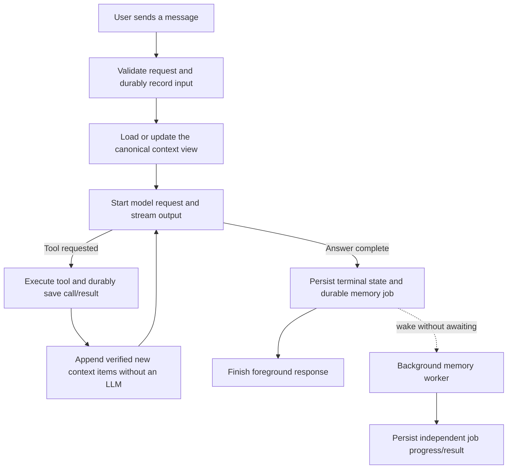

# Ticket #349 — Memory V3 latency and activity wording

Status: implementation, exact-pair local verification, corrected-pair Release QA and the final feature audit are complete with PASS. The ticket is ready for In Review.

- Ticket: https://github.com/haoxiang-xu/PuPu/issues/349
- Release: https://github.com/haoxiang-xu/PuPu/issues/216 (v0.1.12)
- Priority: urgent, must-this-sprint. No invented deadline.
- PuPu workspace: `/Users/red/Desktop/GITRepo/pupu-349`
- Branch: `codex/ticket-349-memory-v3-latency`
- PuPu base: `origin/dev` at `2b8cb2e197d4c873bf9e78c8688e4c21e9457947`.
- Unchain research source: clean `/Users/red/Desktop/GITRepo/unchain`, `dev` at `1c54e19a5d733ccf5a87e085774b0c42c62dd901`. Create an independent companion checkout before implementation; do not edit the shared checkout.

## What & Why

Reduce the delay before useful model output, between a tool result and the next model request, and between the final answer and foreground completion. Preserve Context V2's complete, ordered, durable execution history. Default context should contain required instructions and execution state, the latest valid compaction when available, and subsequent contiguous conversation messages within the real request budget. Read older memory only when requested through memory tools. Explain actual memory activity in ordinary language.

Out of scope: LLM conversation grouping/sections, group retrieval, a new automatic memory-ranking model, a new summarization model, replacement of the journal, changes to memory settings covered by #279, and release publication. “Memory V3” names this ticket's behavior; it does not require renaming all existing protocol/schema versions.

## Read this first

- `AGENTS.md`, `CLAUDE.md`, `.claude/CLAUDE.md`, and `docs/DEV_GUIDE.md`.
- `.claude/rules/cross-boundary-contract-gate.md`.
- `docs/architecture/context-v2-and-memory-v2.md` and `docs/architecture/context-v2-boundary-contracts.md`.
- Unchain `AGENTS.md`, the context compiler/coordinator, journal ports, and curator host described below.
- Use JavaScript/function components/existing inline styles and locale helpers in PuPu. System access stays behind the existing bridges.

## Findings from the current code

1. `ContextCompilerHarness.build_delta()` runs before every model call. `ContextRuntime.compile_context()` invokes the request factory and then the compiler/coordinator.
2. `JournalContextRequestFactory.__call__()` captures a journal snapshot, walks its generation events, and projects semantic events. `ContextCompileCoordinator.compile()` captures another snapshot and `_prepare_journal_view()` validates/projects events again. SQLite `_snapshot_with_connection()` selects the execution's events from the beginning. This is a concrete repeated-work path; its share of observed wall time remains to be measured.
3. Context compilation and checkpoint construction are already deterministic. `_checkpoint_materialization()` stores verified source messages and dependencies; `project_checkpoint_message()` exposes a bounded reference/range marker. This is not an LLM-written summary. Reuse its semantics without presenting it as a richer summary.
4. `PupuMemoryAgentWorkerModule.configure()` installs a synchronous `process_after_enqueue` run hook. Graph `_run_memory_completion()` also calls `memory_worker.process_next()` inline. The legacy `_finalize_memory_v2_curator()` explicitly enqueues and inline-runs curation. These are distinct paths and must not be conflated.
5. Unchain's `MemoryAgentHostAdapter.enqueue_root_completion()` already persists a job without invoking a model; `process_next()` separately claims and executes one. Reuse that separation and its durable lease/CAS protections.
6. Automatic first-message recall exists in PuPu's legacy branch. The inspected Unchain-active factory mounts `JournalContextRequestFactory`; the presence of a standalone recall adapter is not proof that active turns automatically call it. Tests must distinguish these modes.
7. `trace_chain.js` hardcodes `Memory V2 · {status}` and exposes `Active` or context pressure beside it; Memory Agent has a separate row. `memory_v2_trace_presenter.js` and `completion_diagnostics.py` already restrict diagnostic content. Preserve those protections.

No controlled live-provider benchmark has run for this plan. The screenshot's total duration alone does not identify time to first token or prove that all waiting is caused by memory.

Step 1's synthetic baseline is recorded in `ticket-349-evidence/step1-findings.md`. A subsequent read-only inspection matched the screenshot's exact input/cache-write/output token triplet to one local provider receipt and its saved chat trace. Its 18.432-second stream divides into 6.047 seconds before `run_started`, 1.575 seconds from `run_started` to provider start, 10.740 seconds inside the provider call, and 0.071 seconds after provider completion. These are observed wall-clock boundaries, not a claim that the 6.047 seconds are SQL or that provider time is entirely prefill. See `ticket-349-evidence/observed-run-and-logging.md`.

## Target flow and invariants

- The journal remains authoritative; an in-memory context view is disposable derived state.
- Tool execution keeps its existing approval, durable identity, receipt, artifact, and exactly-once/replay guarantees. Only acknowledged durable events may advance the context cursor.
- Default assembly and tool-result append require zero auxiliary LLM calls. Explicit memory search/read is allowed when the main model needs it; returned content remains untrusted data with provenance.
- Keep a chronological suffix and complete tool batches. Never select unrelated old messages merely because a heuristic thinks they are relevant.
- Retain mandatory pending interactions, pinned task state, active instructions/skills and required graph/subagent handoffs. They are execution inputs, not optional recalled memories.
- Respect input budget after instructions, tool schemas, media charges, output reservation and transport margin. Compaction occurs on pressure, not on every tool call. Fail clearly if mandatory content cannot fit.
- Background work cannot alter the immutable context already sent to a provider. New results become eligible at a subsequent request boundary only when needed.
- Current-run curation starts only after its source run is complete and durably enqueued. Previously queued work may run while another response streams, subject to bounded concurrency and foreground priority.

## Ordered implementation steps

### Closeout integration — 2026-09-27

The user authorized updating local PuPu/dev and beginning closeout. The original
PuPu dev checkout is already at remote `8450a98c`; unrelated staged/unstaged work
is preserved. The ticket clone was fast-forwarded to the same base and its
changes reapplied without conflicts. The retained pre-integration stash is a
recovery copy, not delivery evidence. Unchain remains based on `0b2ad609`.

BC-349-04 extension (AC-349-08/09): existing authenticated `listJobs` producer →
HTTP/Electron bridge → expanded Memory Agent details. The response is OPEN to
additional producer fields; the consumed owner identity, unique job/run match,
positive revision and CLOSED five-value status are checked independently in the
renderer. Query at most 100 records for the bound chat. Missing/ambiguous jobs,
unknown statuses, stale revisions and read failures cannot produce success.
Never display returned free-form data in collapsed labels. The sealed RunBundle
is unchanged; owner/chat + assistant message identify the separate UI projection.

SEQ-349-09: collapsed row makes no job request → expand pending row → pending /
leased response → bounded 2-second refresh → terminal response stops refresh.
Collapse, unmount, chat/message change or deleted-chat failure cancels updates;
a late response cannot update another message. The completed answer stays done.
Tests cover lifecycle/foreign scope/error/missing/revision cases; final desktop
verification must bind the integrated candidate and rebuilt final-repair wheel.

Default labels use the existing locale mechanism for all supported locales.
Context pressure and execution mode remain in details. Unknown states are
unavailable, queued is distinct from running, and no-op is distinct from success.
No layout or model/provider selection changes are intended.

### 1. Establish a reproducible latency baseline

Add a focused benchmark/probe around request admission, first provider dispatch, first visible model token, journal read/projection, tool-result commit, next provider dispatch, terminal commit, enqueue, worker execution and foreground done. Keep content and secrets out of measurements. Separate cold start from warm operation and model/provider waiting from local preparation.

Use fixed fake-provider responses and fixtures for: a short greeting, the second message in the same chat, long history, two sequential tool calls, context pressure, and a deliberately slow Memory Agent. Record full-history read counts, events processed, context-assembly LLM call counts, payload token estimates, and median/p95 local durations over 30 measured repetitions after warm-up; report cold cases separately. This establishes measurable improvement without inventing an absolute millisecond promise.

Primary files: PuPu `unchain_runtime/server/unchain_adapter.py`, `memory_v2_unchain_worker.py`, new focused benchmark tests; Unchain `context/runtime.py`, `context/request_factory.py`, `context/coordinator.py`, and `persistence/sqlite_v2.py`.

Checkpoint A: publish baseline and causal breakdown. Do not attribute a slow greeting to the curator unless the trace actually includes a curator invocation.

### 2. Separate durable enqueue from background execution

Introduce a sidecar-owned, bounded memory-work dispatcher in a focused new module such as `unchain_runtime/server/memory_v2_background_worker.py`. A wake notification is not the durable queue: existing Unchain consolidation jobs remain the source of truth. Reconstruct worker capabilities from authorized host configuration; do not persist credentials or retain an entire request context as a queued closure.

Change normal-run hooks, graph-root completion and the supported legacy finalizer to persist completion/enqueue and notify the dispatcher, then return without awaiting the Memory Agent. Keep necessary terminal and enqueue writes synchronous. Reuse the official worker's claiming, fencing, retries and recursion guards. Deduplicate wake notifications, bound workers, and avoid holding journal locks during model calls.

Attach lifecycle start/stop to the sidecar, scan eligible pending/expired work on restart, and leave recoverable durable jobs when shutting down. Re-resolve settings/secrets through existing authorized services; unavailable credentials leave a visible retryable/failed job rather than delaying chat or guessing a provider. The worker's cancellation token is independent from a later foreground turn. Deleted chats and superseded generations must refuse stale writes. The worker must not trigger another curator recursively.

Keep enqueue identity stable per completed root, but distinguish a replayed claim from a new authorized retry after lease expiry. A cached idle/retry receipt must not suppress all future wakes. Since the official host claims the next eligible job, attribute progress to the actual claimed job/root identity, not blindly to the wake that happened to start the worker.

Primary files: `memory_v2_unchain_worker.py`, `memory_v2_unchain_graph_root_completion.py`, `memory_v2_unchain_runtime_factory.py`, `unchain_adapter.py`, `main.py`; Unchain `memory/curator/host.py` and `coordinator.py` only where a public recovery seam is missing.

Verification: block the fake worker on a barrier and assert foreground completion and the next user message proceed before releasing it. Crash after enqueue and recover the job after restart. Assert duplicate wake/retry creates no duplicate durable application. A worker failure must not rewrite a successful chat as failed.

### 3. Introduce an execution-bound incremental context view

The first implementation slice is limited to the run-local committed-event read cache and before/after measurement in [ticket-349-tool-cache-first-slice.md](ticket-349-tool-cache-first-slice.md). Complete and report that slice before implementing the broader projected-state cache, compaction changes, or Memory Agent scheduling below.

First remove redundant request-factory/coordinator reads by sharing one validated, immutable journal view for each model turn. Do not simply remove the coordinator's authority checks or accept caller-provided lists as proof.

Then maintain a bounded process-local cache of canonical projected state, keyed by durable store identity, owner/execution, generation/head revision, and verified source cursor. Track attempt identity separately when building the next request. Load once on cold entry; consume only verified appended events on warm continuations, including intervening tool/interaction events. Cache task-state projections by their durable revision instead of rereading unchanged content. Cache eviction must be harmless and bounded by bytes as well as count.

Add a typed, atomic bounded delta-read capability to the Unchain journal if needed to prove a high-water mark with its returned events. Preserve `JournalSnapshot` v1 semantics: a suffix must never masquerade as a full snapshot. The new view must bind its base cursor/checkpoint, ordered event identities/digests, high-water cursor and source revision; old v1 consumers continue receiving v1 records. Verify a stable source revision and count/range before reuse. External/unrecognized mutations, invalid cursors, gaps, changed store/schema, restart, reset/rebase or deletion invalidate the cache; rehydrate from durable authority or fail closed if that authority is invalid.

Keep model projection caches separate from journal caches. Changes in provider/model, tool schema, system/active-skill instructions, attachment policy or input budget invalidate the affected model projection. Never cache/reuse a prepared provider token, approval permit or prior attempt's interaction authority.

Primary Unchain files: `journal/ports.py`, `journal/snapshot.py` (or an adjacent new typed-view module), `persistence/sqlite_v2.py`, `context/request_factory.py`, `context/coordinator.py`, `context/factory.py`, `context/runtime.py`, `context/task_state_request_factory.py`. PuPu `memory_v2_unchain_runtime_factory.py` supplies lifecycle scope; avoid a second host-side journal implementation.

Checkpoint B: compare cold/full and warm/incremental canonical output for the same source state; prove negative identity cases and cache invalidation before using the path in chat. A tool continuation must perform zero full-history snapshot reads after warm initialization. Re-run GitNexus impact for each exact edited symbol.

### 4. Make default context conservative and reuse valid compaction

Adjust compiler assembly to produce required instructions/state followed by the latest valid compacted base and a contiguous recent suffix. Reuse a committed checkpoint only after verifying its covered range, generation, dependencies and provenance; do not load its entire archived source into every model request. Add an execution/generation-bound committed-checkpoint lookup to the public checkpoint repository if needed; do not query Unchain tables directly from PuPu. Existing checkpoint reference behavior remains reference-based. Do not create a new LLM summary in this ticket.

Avoid rebuilding a synthetic history blob of all completed tool exchanges on each turn. Project each newly persisted exchange into canonical messages in order, and retain it while inside the current window. Keep an unfinished tool batch atomic. Full large outputs remain durable artifacts; their model-visible form remains bounded and references the full output. Incremental projection must still validate pairing, identities and provider-specific formatting.

Disable default automatic long-term recall/injection in applicable PuPu branches under the new behavior. Keep `memory_list`, `memory_search` and `memory_read` available and correctly scoped; no separate LLM router and no default lexical/vector search before dispatch. An explicit retrieval enters context through its normal tool result. Preserve existing user-authored instructions and required execution state.

Implementation decision for this slice: add one bounded, execution-bound newest-first committed-checkpoint lookup to the public checkpoint repository. The coordinator reads each candidate through that repository, reconstructs its exact source/dependency proof from the current journal snapshot, and compares the complete canonical payload before binding it. A different prefix, generation, dependency receipt, provenance, or payload cannot be reused. The compiler then emits that verified checkpoint plus one contiguous suffix, including only completed tool exchanges after the checkpoint coverage boundary.

Primary files: Unchain `context/compiler.py`, `checkpoints.py`, `coordinator.py`, `model_projection.py`, `context/tool_transitions.py`; PuPu `unchain_adapter.py` recall wiring. Keep standalone recall APIs usable for explicit requests.

Verification: unrelated old memory appears nowhere in a simple greeting's provider payload; requested recall works; a complete tool batch stays ordered; checkpoint reuse does not duplicate covered messages; exact budget tests pass with long tool output, images/PDFs, and changed model windows.

### 5. Keep deferred work separate from the live answer

First implemented slice: [deferred background preparation](ticket-349-defer-independent-work.md).
Memory Agent invoker construction is lazy and background-host registration runs
only before eligible root completion enqueue. Frozen-pair tests and diagnostic
desktop verification passed, but measured moved work is only milliseconds and
full admission did not improve. The historical pre-model delay remains unresolved;
do not mark the entire latency goal complete from this slice.

Audit pre-dispatch operations identified in step 1. Move only work that is independent of current request correctness/context to the dispatcher or a bounded post-dispatch task. Keep admission, authorization, current input/tool durability, required context compilation, required build receipts and provider schema validation before dependent model/tool effects.

Queue background progress through existing bounded diagnostic/journal read seams. Foreground completion has its own terminal status; background job status must not keep the chat spinner or send button busy. A finished content-addressed RunBundle is immutable: later curator changes are separate job records, not edits to the sealed bundle or late frames on a closed response stream.

Fetch job/detail information lazily on expansion or while an already-visible pending background row needs refresh; use a bounded status query rather than scanning the full journal for each refresh. Stop refresh on terminal status, chat change, unmount or deletion. Preserve cursor limits and error behavior.

Primary files: `completion_diagnostics.py`, `memory_v2_unchain_curator_query.py`, `route_memory_v2.py` if a bounded status projection is required, existing bridge counterparts, `memory_v2_journal_reload.js`, and chat-stream completion handling only where demonstrated necessary.

### 6. Replace technical default labels with truthful activity wording

Reuse the current trace row and expand/collapse behavior. Keep Memory V2 version, Active/shadow modes, context pressure, raw codes and identity references in details. No new settings page or component primitive is needed.

| Actual activity | Default English wording | Default Chinese wording |
|---|---|---|
| Preparing context | Preparing conversation… / Conversation ready | 正在准备对话… / 对话已准备好 |
| Explicit recall in progress | Finding relevant memories… | 正在查找相关记忆… |
| Recall success / empty | Relevant memories found / No relevant memories found | 已找到相关记忆 / 未找到相关记忆 |
| Background work queued / running | Memory organization queued / Organizing memories… | 等待整理记忆 / 正在整理记忆… |
| Background complete | Memories organized | 记忆整理完成 |
| Background failed | Memory organization failed | 记忆整理失败 |
| Foreground context failure | Could not prepare conversation | 无法准备对话 |

Do not show a recall row without a retrieval event, a running label for merely queued work, a success label for unavailable state, or a memory-processing row for every deterministic tool append. A no-op background job need not create a default row. Preserve useful technical error details under expansion.

UI inventory: (1) context/recall activity row in `TraceChain`; (2) background Memory Agent row; (3) existing `MemoryV2ContextAudit` / `MemoryAgentAudit` expanded detail panels. Reuse current styling, theme and spacing. The project owner has been asked which components need visual alternatives; no visual design is selected or implemented in this planning turn. The proposed minimum scope is wording/state changes with the current layout.

Primary files: `src/COMPONENTs/chat-bubble/trace_chain.js`, `memory_v2_trace_audit.js`, `src/SERVICEs/runtime_events/memory_v2_trace_presenter.js`, and `src/locales/*.json` via the project's locale conventions. Verify light/dark, English/Chinese, loading/empty/error, reload and pending-to-complete behavior.

Checkpoint C: review the status producer/consumer pair and screenshots together; make sure background job completion does not reopen a finished foreground run.

### 7. Validate recovery, repeated use and the exact runtime pair

Run the AC/SEQ matrix below, including two consecutive user messages and two sequential tool/approval cycles. Compare the optimized path with a forced cold rebuild. Add negative cases for stale/wrong execution, wrong generation, missing tool results, corrupted checkpoint refs, concurrent append, cancelled attempts and changed provider/tool schema.

Build one Unchain wheel after core changes; install and reuse those exact bytes in the isolated PuPu sidecar environment. Record wheel SHA-256 and the actual imported runtime protocol manifest digest. Test PuPu's producer/consumer boundaries with that wheel and strict provider fakes. Restart the sidecar after Python changes before runtime verification. Do not treat tests against the mutable sibling checkout as deployed-pair evidence.

Repeat the step-1 benchmark with identical fixtures and settings. Require the structural goals below and report median/p95 changes; do not declare success from an earlier UI spinner alone. Keep the full compiler fallback until parity and recovery cases pass. Never fall back by disabling durability or accepting malformed contracts.

### 8. Update technical documentation and present implementation evidence

Update the existing architecture/boundary docs and this same plan to match the implemented flow. Post the changes, benchmark comparison, actual test commands/results, runtime pair and remaining limitations to #349. Keep all current planning checks labelled NOT_RUN until executed. Product implementation, commits, PR creation and ticket closure are not part of this planning turn.

## Boundary contracts

The existing CTX-B01 through CTX-B09 profiles remain applicable where touched; the task-local contracts below add explicit optimization obligations. Strict tests use real producer output and independently validated consumers, not a shared permissive mock.

| ID | Producer → consumer / representation / policy | Identity, projection and failure rules | Evidence |
|---|---|---|---|
| BC-349-01 | Unchain SQLite journal → process-local verified prefix cache → request factory/coordinator. The implemented first slice keeps existing VERSIONED JournalSnapshot v1 and JournalPage shapes; it returns a complete snapshot, never a suffix disguised as a snapshot. No new serialized delta/view protocol was introduced. SQLite schema v3 adds the integrity revision and mutation triggers. | Bind the exact journal object/store, execution, high-water cursor, ordered events and integrity revision. Existing compiler validation retains generation/attempt authority. Capture the initial snapshot/revision atomically; validate prefix and tail and recheck revision. Reject invalid identity/digest/completeness; evicted views rehydrate and corrupt durable state fails closed. No Git-based admission. | AC-349-02/03/06/07; real SQLite mutation/recovery tests, full-snapshot comparison and context/provider differential tests in the cache checkpoint report. |
| BC-349-02 | Durable tool/interaction receipts and artifacts → canonical ordered message projection → exact provider wire. CLOSED projection and provider schemas. | Append after durable acknowledgement, preserve call/result IDs and ordering, keep full artifact refs scoped, retain checkpoint dependencies and request budget. No internal metadata/receipt/cache fields on provider wire. Invalid pairing, unknown wire fields, wrong attempt or unsupported media fail before dispatch. | AC-349-03/04/06/07; real event sink → compiler → independently strict OpenAI/Anthropic/Gemini/Ollama consumers on supported paths. |
| BC-349-03 | Root completion → existing durable curator job → sidecar dispatcher → official Memory Agent host. Existing VERSIONED job/lease shapes; content-free wake identity is CLOSED. | Owner/binding/execution/root-run/trigger/job revision remain exact. Wake is only a hint. Claim/retry/restart uses lease fencing/CAS. No candidate content or secrets in a wake record. Duplicate wakes may retry work but cannot duplicate durable application; stale/deleted identities refuse. Worker failures do not change successful foreground terminal state. | AC-349-05/06/07; real enqueue/claim output, strict worker binding, blocked-worker and restart barriers. |
| BC-349-04 | Sidecar diagnostics/job status → HTTP/SSE/IPC bridge → presenter/trace rows. VERSIONED closed bounded diagnostics; canonical RunBundle remains immutable. | Bind owner/run/job; monotonic revision/status processing. No late mutation of a sealed bundle and no foreign-chat update. Reject malformed/version-mismatched transport records; show unavailable/failed without inventing success. Unknown internal statuses map conservatively. No content/secrets in default labels. | AC-349-08/09; real diagnostic serializer → strict bridge consumer → render assertions. Update both Electron test variants if changed. |
| BC-349-05 | Imported Unchain runtime manifest + one built wheel → PuPu admission and packaged verification. VERSIONED closed protocol manifest; CLOSED artifact identity evidence. | Negotiate any new view capability explicitly. Missing/invalid capability must refuse the optimized path before effects; preserve supported old deterministic behavior where already admitted. Wheel SHA and manifest digest must be the same across pair tests. Source revision is provenance only. | AC-349-07/09; wrong-version/feature negatives plus fixed-wheel contract and package smoke evidence. |
| BC-349-06 | PuPu sidecar timing producer → stderr line → Electron `UNCHAIN.RUNTIME_LOG` relay. The transport is OPEN text with a fixed `[chat-latency]` prefix; the producer's JSON object is versioned `pupu.chat_latency.v1`. Electron relays the line as text and does not parse or act on JSON fields; future record extensions may add fixed, non-content timing fields only. | Emit bounded integer timings, fixed stage/outcome names and truncated SHA-256 keys for session/attempt correlation. Never copy prompt, answer, tool arguments/results, provider payload, secrets or raw identifiers. Unknown event types are ignored; diagnostic write failures never affect SSE or completion. Logs are observational, not runtime admission or provider wire. | AC-349-10; log-shape/privacy tests, actual v4 route producer with unchanged SSE frames, and existing Electron runtime-log relay tests. Runtime-pair rollout remains incomplete until the exact artifact pair is checked. |
| BC-349-07 | PuPu active/graph admission → first-turn context handoff. The default long-term-recall policy is CLOSED: no recall lookup, candidate creation, reference binding or handoff injection occurs before a model request. Explicit `memory_list`, `memory_search` and `memory_read` remain normal toolkit calls and their durable tool results use BC-349-02. | Bind the bypass to the active admission and preserve the same root/graph entry identity, user-authored instructions and current request bootstrap. An old-memory reference cannot reach the provider payload without an explicit tool call; malformed or foreign references remain rejected by the existing toolkit authorizer. | AC-349-02/04/07; active and graph entry tests assert the recall function is not called, simple provider payloads omit seeded old memory, and explicit read continues through the tool-result path. |
| BC-349-08 | PuPu's execution-bound checkpoint repository → Unchain context coordinator. The lookup is CLOSED and bounded: newest committed references for the exact owner/session/generation/attempt only; content remains unread until the coordinator asks the same bound repository. Before a new write, the official repository returns the exact deterministic checkpoint reference for the already-materialized operation; this preview is read-only and must equal the later prepared reference. Retained repositories that omit or reject preview are supported through a prepared-ref verification loop: the compiler does not price a fabricated identity, and the coordinator expands only the complete omitted prefix until the actual marker fits. | Reject foreign, deleted, superseded, uncommitted, malformed, oversized, or snapshot/dependency-mismatched candidates before provider dispatch. The coordinator compares the complete canonical payload after rebuilding its source/dependency proof. A selected checkpoint can replace only its exact contiguous prefix; tool pairs crossing the coverage boundary remain whole. Price the official repository's exact future marker before preparation and reject identity drift. For a retained repository without preview, never commit a candidate until the actual prepared marker passes the same budget and consumption proof; if it does not fit, retry at the next complete-turn cutoff. | AC-349-04/07; committed-reuse, cross-scope, changed-dependency, corruption, bounded-list, exact budget-boundary, absent/unsupported/exact-preview, preview-identity, fallback-expansion, and complete-tool-pair tests. |

### Final-audit repair contracts — 2026-09-27

BC-349-07 extension (F1; AC-349-02/07/09): official `MemoryEntry`
or workspace-capability result → model-facing Memory toolkit projection → PuPu
reference codec. Internal `unchain.memory_entry.v1` schema and
`memory_content` `content_ref` are storage metadata and never enter the model
result. The visible result is OPEN for ordinary entry metadata but CLOSED for
identity: one canonical `entry_ref` must bind the capability's exact space,
entry ID and revision. Existing-entry mutations must return the requested entry
at exactly the next revision; creation must return revision 1. History must stay
on that entry, be strictly newest-first and not exceed the requested limit.
Reject malformed or foreign-space refs and any divergent `entry_id`, `space_id`
or `revision`. Apply the same projection to list, search, upsert, move,
supersede, archive and history; `memory_read` remains the authorized body-read
path. Evidence must use a real workspace capability, strict PuPu codec,
populated save → background apply → list → search → exact read, plus invalid-ref,
foreign-owner, divergent-identity and invalid-revision negatives.

BC-349-08 extension (F2; AC-349-04/06/07/09): committed checkpoint discovery
performs bounded ref lookup → exact durable metadata lookup → eligible payload
read. Automatic reuse is CLOSED to a committed `PreparedCheckpoint` whose bound
ref is exact and whose operation ID is exactly
`context-checkpoint.checkpoint-<64 lowercase hex>`. Host and legacy operations,
including plain-text summaries accepted by the public checkpoint port, are
skipped before content read or JSON parsing. Adapters without exact metadata
lookup disable automatic reuse safely. The SQLite lookup binds execution, ref,
revision and fragment and verifies the operation claim's payload digest, target
kind and target key in the same transaction. Admitted compiler-owned records
retain strict schema, request, materialization and operation verification;
corruption still fails closed.

BC-349-04 extension (F3/F4; AC-349-08/09): immutable completion diagnostics and
the authenticated OPEN `listJobs` page converge through one renderer merge.
Consumed identity is CLOSED: bound owner/message, non-empty `job_id`, optional
`run_id` from either the top level or legacy `payload.trigger.run_id`, positive
revision and the existing closed status vocabulary. Preserve both job and run
identity and use `job_id` as the canonical row ID when available. Conflicting
top-level/nested run IDs, foreign scope and ambiguous matches cannot produce a
successful state. Initial presentation, discovery, polling and prop updates all
use the same bounded merge: a lower revision or lower active-state rank cannot
replace a newer state, and a terminal state is immutable. Pending/leased status
continues bounded polling case-insensitively; terminal status stops it.

## Acceptance and sequence tests

| ID | Observable acceptance |
|---|---|
| AC-349-01 | Fixed-fixture before/after measurements distinguish cold/warm, first dispatch/token, tool continuation and foreground done. Report 30-run warm median/p95, read/processing counts and auxiliary LLM counts. Optimized targeted segments improve without hiding model wait; investigate any regression before rollout. |
| AC-349-02 | Ordinary context preparation performs zero auxiliary LLM calls and zero unsolicited older-memory search/injection. One validated view feeds a model turn; warm same-generation tool continuations perform zero full-history snapshot reads. Explicit retrieval remains functional, including populated save/apply/list/search/read with the exact stored body. |
| AC-349-03 | Every executed tool call/result remains durably recorded with exact identity/order and complete output or verified full-output artifact; next context consumes committed results once. Failed writes cannot be represented as saved or permit a dependent model request. |
| AC-349-04 | Latest valid compaction/checkpoint and chronological suffix respect the real budget and preserve mandatory inputs and complete tool groups. No arbitrary old-message selection, duplication of covered messages or new LLM grouping. Oversized mandatory state fails explicitly. Host/legacy plain-text checkpoints do not block compilation; compiler-owned checkpoints retain strict verification. |
| AC-349-05 | A deliberately blocked/failed background worker does not delay foreground completion or the next message. No-candidate turns launch no Memory Agent. Queue/retry/restart remain durable; stale leases cannot apply changes. |
| AC-349-06 | Cold/full and incremental canonical model contents agree for the same admitted source state. Retry, resume, restart, reset/rebase, deletion and concurrency never use stale cache state, duplicate tool effects or resurrect deleted memory. |
| AC-349-07 | Real producer → independently strict consumer tests reject wrong execution/generation/attempt, unknown fields/version, corrupt checkpoint/digest and invalid provider wire. Real `MemoryEntry` results pass the strict PuPu codec without internal storage refs, and real SQLite checkpoint metadata reaches the coordinator with positive and negative contract coverage. Normal, graph-root and subagent paths preserve their distinct scopes. |
| AC-349-08 | English/Chinese ordinary labels truthfully reflect preparation, actual retrieval and independent background work; technical version/mode is in details. Pending, empty, failed and unavailable states are distinct. Details/status reads are lazy and bounded. Concurrent discovery/poll results cannot regress revision or a terminal state, and legacy nested run identity retains the canonical job row. |
| AC-349-09 | The same built wheel SHA-256 and actual imported manifest digest pass the PuPu pair tests and smoke run after sidecar restart. Tests against a mutable sibling alone do not satisfy delivery evidence. |
| AC-349-10 | One bounded, content-free timing record per v4 request distinguishes pre-run setup, model-request-ready/first visible output, tool continuation and foreground done. Graph compile/preflight/bootstrap/setup/worker-to-first-run timings identify the largest pre-run stage without changing the event wire. Repeated and failed/cancelled runs remain attributable by anonymized identity and outcome. |

| Sequence | Initial state → ordered events → expected observations | Boundaries / acceptance |
|---|---|---|
| SEQ-349-01 | Empty chat → first message → terminal → second message in same chat: correct canonical history, no default recall, reuse where generation permits, independent background status. Identity: owner/execution/generation/attempt/cursor. | BC-349-01/BC-349-02/BC-349-03/BC-349-04; AC-349-01/AC-349-02/AC-349-05/AC-349-06/AC-349-08 |
| SEQ-349-02 | Tool A call/approval/result → tool B call/approval/result → next model request: unique interactions, complete receipts, ordered incremental append, no A approval reuse for B. | BC-349-01/BC-349-02; AC-349-02/AC-349-03/AC-349-06/AC-349-07 |
| SEQ-349-03 | Persist pending interaction → stop sidecar → explicit durable resume → terminal; repeat retry before/after durable result acknowledgement: rebuild once, no duplicate external effect, same authority. | BC-349-01/BC-349-02/BC-349-05; AC-349-03/AC-349-06/AC-349-07/AC-349-09 |
| SEQ-349-04 | Enqueue job → duplicate wake → worker claim → crash/lease expiry → restart/retry → apply: bounded workers and one durable application; foreground remains done throughout. | BC-349-03/BC-349-04; AC-349-05/AC-349-06/AC-349-08 |
| SEQ-349-05 | Warm cache → checkpoint pressure → next turn → provider/budget/tool-schema change → reset/rebase/delete: correct checkpoint reuse or invalidation, no missing pair or stale authority. Test compatible fallback/rollback without rewriting the journal. A committed host-authored plain-text checkpoint is skipped without payload read/parse, a later compiler checkpoint remains reusable, and operation-claim or compiler-payload tampering fails closed before dispatch, including after cold restart. | BC-349-01/BC-349-02/BC-349-05/BC-349-08; AC-349-04/AC-349-06/AC-349-07 |
| SEQ-349-06 | Graph root with two steps/interactions and a subagent handoff → root terminal → enqueue: child completions retain provenance; only authorized root schedules curation. | BC-349-01/BC-349-02/BC-349-03; AC-349-03/AC-349-05/AC-349-06/AC-349-07 |
| SEQ-349-07 | Load fixed wheel/manifest → positive runtime admission → each supported provider fake → incompatible manifest negative → UI reload of a pending/completed job: exact artifact continuity and truthful status. | BC-349-02/BC-349-04/BC-349-05; AC-349-07/AC-349-08/AC-349-09 |
| SEQ-349-08 | Fresh v4 request → optional graph setup → run start → provider request/result → optional tool continuation → terminal; repeat for a second turn, cancellation and failure. The same hashed session/attempt keys correlate bounded logs while raw content remains absent. Logging failure cannot change SSE or durable state. | BC-349-06; AC-349-01/AC-349-10 |
| SEQ-349-09 | Collapsed row makes no request → expansion binds the foreground job/run identity → legacy nested-run discovery and polling overlap → revision 3 terminal arrives before revision 2 active → the late active result is ignored and the canonical job row remains terminal. Collapse, unmount, owner/message change and failure cancel updates; conflicting or foreign identity becomes unavailable. | BC-349-04/BC-349-05; AC-349-08/AC-349-09 |
| SEQ-349-10 | Authorized turn proposes memory → background job durably applies it → explicit list returns a canonical entry ref → search returns the same entry → read returns the exact body → cold restart repeats retrieval. Invalid, foreign-owner, divergent and invalid-revision refs fail before content disclosure. | BC-349-03/BC-349-05/BC-349-07; AC-349-02/AC-349-07/AC-349-09 |

### Cache checkpoint closeout — 2026-09-26

The current cache slice's fixed-wheel local tests, exact context/provider
comparisons, final performance, SQL counts/bytes and allocation probes are
complete. See [the English evidence and contract status](ticket-349-evidence/cache-checkpoint-closeout-2026-09-26.md)
and [the Chinese explanation](ticket-349-evidence/cache-checkpoint-closeout-2026-09-26.zh-CN.md).
This supersedes the prior audit's missing local measurement/differential evidence;
it does not supersede the outstanding whole-ticket delivery requirements.
At this checkpoint, BC-349-05 / AC-349-09 were incomplete for official artifacts,
packaged smoke and a restarted real sidecar. The 2026-09-27 final-audit repair
evidence supersedes that delivery state; the historical cache measurements remain
valid only for their recorded candidate. AC-349-01's matched full-app timings remain
unmeasured, so no whole-turn speedup is inferred from the cache checkpoint.

All acceptance/sequence executions are NOT_RUN at planning time. An unreachable case needs an explicit reason for N/A; a missing test is not N/A. Do not enable a new optimized runtime capability while applicable boundary/recovery evidence is incomplete.

## Verification commands and fixtures

Run from the named isolated repository/environment. These are proposed commands, not claims of passing tests.

- Unchain: `./run_tests.sh --tb=short -k 'context_compile_coordinator or context_ingress_request_factory or journal_snapshot or checkpoint_consumption or compiler or task_state_request_factory or memory_agent_host or curator_coordinator or provider_message_contract or runtime_protocol_manifest'`. The repository script uses its own Python 3.12 environment; prepare it using the documented initializer. Add focused delta/view/cache tests and a performance probe alongside the existing context tests.
- PuPu Python, from `unchain_runtime/server` with the candidate wheel installed: `python -m pytest -q tests/test_memory_v2_unchain_worker.py tests/test_memory_v2_unchain_graph_root_completion.py tests/test_memory_v2_unchain_graph_root_completion_entry.py tests/test_memory_v2_unchain_active_stream.py tests/test_memory_v2_unchain_active_resume.py tests/test_completion_diagnostics.py tests/test_context_memory_v2_runtime_protocol.py`. Include new dispatcher/restart and incremental-context integration tests as they are added.
- PuPu renderer: `CI=true npm test -- --watchAll=false --runInBand src/SERVICEs/runtime_events/memory_v2_trace_presenter.test.js src/COMPONENTs/chat-bubble/trace_chain.memory_v2.test.js src/COMPONENTs/chat-bubble/chat_bubble.memory_v2_mount.test.js src/COMPONENTs/chat-bubble/memory_v2_journal_reload.test.js`. Use the existing react-scripts runner, not direct Jest.
- Reuse the strict fake-provider and long-run harness patterns in `scripts/test-api/`; keep performance fixtures deterministic and temporary stores isolated. Add a repeat-message/tool scenario and slow-curator barrier rather than relying only on snapshot assertions.
- Run affected graph/resume/attachment/skills/provider contract suites and exact packaged-pair smoke before delivery. Live provider timing is supplementary; it does not replace deterministic local-overhead evidence.

## Impact, execution responsibility and checkpoints

Core changes span persistence, Context compiler ownership, provider projection, worker lifecycle and visible completion. Treat the overall work as high engineering risk even when a graph walk reports few callers. Do not skip build receipts or validation to gain latency. Shared SQLite contention and background provider competition must be measured, not assumed away.

Unchain GitNexus is current at the researched commit. `ContextRuntime.compile_context` resolves to LOW graph risk with three direct dependants: active/shadow compiler harnesses and a task-state override; both harness flows are affected. `ContextCompileCoordinator.compile` is UNKNOWN because receiver typing hides calls; source inspection confirms `ContextRuntime.compile_context` selects `bundle.coordinator` and calls `compiler.compile(request)`. UNKNOWN is not evidence of safety.

PuPu was indexed independently in this ticket's clone at the recorded base. `_finalize_memory_v2_curator` has LOW graph risk, three direct callers (normal streaming, interaction resume and recipe graph streaming), and five total affected symbols. `_run_memory_completion` has LOW graph risk, one direct caller and two affected symbols through graph-root completion/run_workflow. `presentMemoryV2Audit` has LOW graph risk and one direct consumer, `TraceChain.timelineItems`, participating in 12 reported flows. The index reports whole-repository flow limits and unresolved dynamic/cross-language edges; these counts are not proof that unlisted paths are unaffected. Read-backed call sites supplement the graph, and fresh exact-symbol impact is mandatory before later product edits.

Weaker-model suitability: **partially suitable**. The strong agent retains incremental-view contracts, checkpoint validity, durable worker recovery, provider compatibility and integration. Once labels and event contracts are settled, a bounded UI wording/localization slice and explicit fixture additions are suitable for an available lower-cost model such as `gpt-6-luna`, with a supplied file/test scope and strong review at the end. No worker has been dispatched. No whole-ticket delegation. Checkpoints A/B/C above plus final fixed-wheel review occur before dependent slices proceed.

Stop conditions for an implementation worker: a required source identity cannot be proven, protocol/schema changes extend beyond this plan, an existing recovery invariant fails, the worker needs to invent context selection semantics, or a requested visual design is still undecided. Report the evidence to the strong agent before dependent changes. No commits/push during start; no rollout or PR in the current plan-only request.

## Final closeout — 2026-09-27

The owner authorized delivery after updating local PuPu/dev. Integrated base: `8450a98cb841e5c695552c5e3d44819990ab727d`. The final product repair is PuPu `8622ad2fe899ec80c266d889e57b348f00c3b28d`, followed by Release QA pin repair `c6a1a4b291cf95fd9549067040631e75eef2f79a` on [PR #361](https://github.com/haoxiang-xu/PuPu/pull/361), paired with Unchain `93e97c0a9239488ea0dc9379335aa8cb73d95815` ([PR #40](https://github.com/haoxiang-xu/unchain/pull/40)). Release QA now pins that immutable Unchain revision under BC-349-05. The rebuilt wheel is `sha256:d6cbdeb02c1b75cf711631b09e5b6a417077c4636b46658136ccd893565a5bf0`; its imported runtime manifest is `sha256:84bc5ed2b528ad4d36d4798837834b8539b951287406b0c3ae6a7ba2e943643e`.

BC-349-04 / SEQ-349-09 also cover job discovery: the completion bundle can predate enqueue, so opening conversation details reads the existing job endpoint and accepts only jobs whose run_id equals that message's root_run_id. The discovered job ID becomes the subsequent polling identity. Tests consume a real producer page and reject foreign identity/unknown or stale states. Collapsed rows do no discovery; polling remains limited to expanded pending-job details. No backend status event or sealed bundle is fabricated.

AC-349-04 compatibility repair: legacy PupuExecutionJournal read() and capture_snapshot() have different physical/logical projections. Its additive Context host explicitly uses full snapshots; production Unchain-owned context retains incremental caching. Existing unavailable-build retry was red before the fix and green afterward. No SQL schema change was needed.

The isolated exact-wheel desktop run completed propose → background apply → fresh list → fresh search → fresh read before restart. After a real desktop-process restart, a fresh list call returned the same canonical entry reference without exposing `content_ref`. The model answered the requested post-restart search/read from durable prior tool history without issuing new calls; the harness rejected those responses, so fresh live post-restart search/read are not claimed. Exact-wheel deterministic restart tests cover persisted FTS search, read/list lifecycle and cold apply replay.

The historical timing tables remain in the [original closeout report](ticket-349-evidence/closeout-report-2026-09-27.md). Final repaired-pair correctness, artifact identity, tests and live-evidence limits are recorded in the [final-audit repair report](ticket-349-evidence/final-audit-repair-2026-09-27.md), which supersedes the earlier final9 artifact conclusion. The original six-second pre-run gap remains unattributed and is not claimed as saved. This delivery does not include release rollout, a signed installer, or a matched full-app TTFT A/B result.
