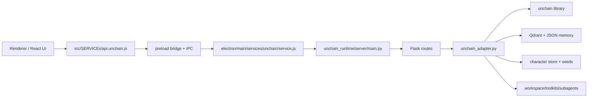

# unchain runtime 结构与功能分析

## 一句话结论

`unchain runtime` 不是单独的一个 Python SDK，也不是纯前端聊天层；它本质上是 PuPu 内部的一套本地 Agent Runtime 子系统，由 Electron 主进程负责拉起，再通过一个本地 Flask 服务把 `unchain` Agent、toolkit、memory、character、流式事件这些能力统一暴露给前端。

它的实际形态是：

1. Electron 主进程里的 runtime manager
2. 一个本地回环地址上的 Python 服务
3. 一个把 `unchain` 库适配成 PuPu 接口的 adapter 层
4. 若干面向 UI 的子系统：聊天流、工具确认、工作区工具、记忆、角色、模型目录、toolkit 目录

## 它在 PuPu 里的位置

如果按职责切分，它是一个典型的“三段式”结构：

- 前端消费层：React 页面和 `src/SERVICEs/api.unchain.js`
- 桌面桥接层：preload bridge + Electron IPC + main process service
- 本地执行层：Python Flask runtime + `unchain_adapter`

## 目录怎么分

### 1. 运行时服务本体

- `server/main.py`
  - 运行时入口。
  - 读取端口、父进程 PID、host 等环境变量。
  - 启动线程化 Flask 服务，并在父进程退出时自动停机。

- `server/app.py`
  - 创建 Flask app。
  - 注入版本号、鉴权 token。
  - 注册总路由蓝图。

- `server/server_thread.py`
  - 用 `werkzeug.make_server(..., threaded=True)` 包一层线程服务器。
  - 说明这个 runtime 是“单进程 + 多线程 HTTP 服务”，不是 gunicorn 之类的多 worker 架构。

### 2. HTTP 路由层

- `server/route_catalog.py`
  - 健康检查
  - 模型目录
  - toolkit 目录
  - toolkit 元数据

- `server/route_chat.py`
  - `/chat/stream`
  - `/chat/stream/v2`
  - `/chat/tool/confirmation`
  - 负责把前端 payload 规范化后转给 adapter，并把结果转成 SSE。

- `server/route_memory.py`
  - 替换 session memory
  - 导出 session memory

- `server/route_projection.py`
  - 短期记忆向量投影
  - 长期记忆向量投影
  - 主要给 UI 做 memory 可视化。

- `server/route_characters.py`
  - 内置角色 seed 列表
  - 角色 CRUD
  - 头像读取
  - 角色预览
  - 构建角色 agent 配置
  - 导入导出

- `server/route_auth.py`
  - 限制只接受 loopback 请求
  - 校验 `x-unchain-auth` / query token

### 3. 核心适配层

- `server/unchain_adapter.py`
  - 这是整个 runtime 的核心。
  - 负责把 `unchain` 库的 Agent、Memory、Toolkit、Subagent、Prompt 模块化配置，适配成 PuPu 需要的行为和事件格式。

### 4. 数据与领域子系统

- `server/memory_factory.py`
  - 构建 `MemoryManager`
  - 管理 Qdrant 向量库
  - 管理 session JSON 和 long-term profile JSON
  - 支持 memory 重建、删除、长期记忆清理

- `server/character_*.py`
  - 角色注册表
  - 头像处理
  - 默认 seed 角色
  - 导入导出
  - 角色配置生成

- `server/character_seeds/*`
  - 内置角色素材和 spec/profile seed

### 5. 打包与遗留层

- `scripts/build_unchain_server.sh`
- `scripts/build_unchain_server.ps1`
  - 用 PyInstaller 打出 `unchain-server` 独立二进制。

- 仓库内的 `miso/engine.py` 本地 stub 已移除。
  - 当前 Python 运行入口统一以 `server/main.py` 为主。
  - 打包脚本里出现的 `miso` 依赖指向外部源码包，不是这个仓库内的本地 stub 目录。

## 它究竟是什么结构

从代码真实状态看，`unchain runtime` 更像“本地 Agent 网关”，不是一个简单的聊天后端。

它内部包含五个并列能力面：

1. Agent 运行层
2. Tool 调度层
3. Memory 层
4. Character 层
5. UI 协议转换层

### 1. Agent 运行层

核心逻辑在 `server/unchain_adapter.py`。

它会做这些事：

- 确保开发态下能把外部 `unchain` 源码目录挂到 `sys.path`
- 根据 provider/model/API key 组装 runtime config
- 把历史消息、附件、system prompt、用户模块化 prompt 合并成最终上下文
- 创建 `unchain.agent.Agent`
- 接入 memory module、tools module、policies module、optimizers module、subagent module
- 以 callback 的形式把 token、tool call、final message、subagent 事件流式抛出

一个非常关键的判断是：

- 代码里保留了 `general agent -> developer subagent` 的设计能力
- 但当前 `_create_agent()` 的主路径直接返回的是 developer agent

也就是说，当前真正跑在主链路上的并不是“总控 agent 再转交给 developer agent”，而是：

- developer agent 直接作为主 agent 执行
- 该 developer agent 可以继续 delegate 到只读 analyzer / executor 这类子代理

这点很重要，因为它说明现在的 runtime 更偏“面向工程任务的 Agent Runtime”，而不是通用聊天壳子。

### 2. Tool 调度层

runtime 不只是把模型调用包起来，它还把工具系统一起编排了进去。

主要能力包括：

- 自动发现 `unchain.toolkits`
- 暴露 toolkit catalog 和 toolkit metadata 给前端
- 构建 workspace toolkit
- 支持多 workspace root
- 对写文件、删文件、移动文件、执行终端命令强制确认
- 把工具确认事件转成前端可消费的交互协议

比较有特点的点有两个：

#### 多工作区支持

如果底层 toolkit 不原生支持多 root，adapter 会退化成一个 proxy toolkit，把不同 workspace 的工具改名后合并进去，比如：

- 默认 workspace 继续用原始工具名
- 额外 workspace 会生成带前缀的代理工具名
- 并附带 `list_available_workspaces` 工具告诉模型有哪些工作区可用

#### 人工确认与人工输入

runtime 支持两类“人类参与”：

- destructive tool confirmation
- `ask_user_question` 这类 human input

这意味着它不是 fire-and-forget 的工具执行器，而是带前端交互闭环的 agent runtime。

### 3. Memory 层

`memory_factory.py` 说明这个 runtime 自带完整的短期/长期记忆实现，不只是把对话历史简单回传给模型。

它的结构大致是：

- 短期 memory
  - session JSON store
  - Qdrant 向量索引

- 长期 memory
  - long-term profile JSON
  - Qdrant long-term collections

- embedding provider
  - OpenAI
  - Ollama
  - 自动回退选择

它能做的事包括：

- 根据设置决定是否启用 memory
- 自动解析 embedding provider
- 构建 `MemoryManager`
- 为 session 重建短期向量索引
- 导出 session memory
- 删除某个 session 的短期记忆
- 删除某个 namespace 的长期记忆
- 生成 memory projection 数据给前端可视化

这里的一个设计特征是：

- 记忆数据既有“结构化 JSON 存储”
- 也有“向量索引”

所以它不是单纯的 transcript store，而是“可检索记忆系统”。

### 4. Character 层

character 子系统不是 UI 装饰，而是 runtime 的正式能力面。

它支持：

- 内置 seed 角色
- 自定义角色保存
- 头像管理
- 角色行为预览
- 基于角色 spec 构建 agent config
- 导入/导出角色包

换句话说，角色在这里不是一个 prompt snippet，而是一个带：

- spec
- avatar
- self profile
- relationship profile
- owned session ids
- known human ids

的完整实体。

这说明 runtime 的目标之一，是让“角色化 agent”成为一等能力，而不是聊天 UI 上的一层皮。

### 5. UI 协议转换层

`route_chat.py` 和 Electron 侧的 service/preload/api 共同构成了一层协议转换。

前端并不直接感知 `unchain` 原生事件，而是消费 PuPu 自己整理过的事件模型：

- v1 stream: `meta` / `token` / `done` / `error`
- v2 stream: 更细的 `frame`
  - token delta
  - reasoning
  - tool call
  - tool result
  - final message
  - stream summary
  - subagent 相关事件

这层的意义是：

- 把底层 agent 事件协议稳定成前端 API
- 把 Python SSE 再桥接成 Electron IPC 事件
- 让 React UI 不需要知道 Python 进程细节

## 它启动时怎么工作

实际启动链路如下：

1. Electron `app.whenReady()` 调 `unchainService.startMiso()`
2. 主进程决定是启动打包好的 `unchain-server`，还是开发态的 `server/main.py`
3. 自动选择端口，优先 `5879-5895`，不行就回退到临时端口
4. 生成随机 auth token
5. 通过环境变量把 host、port、provider、model、data dir、parent pid 传给 Python 进程
6. 主进程轮询 `/health` 直到 runtime ready
7. 前端后续所有 unchain 请求都走 Electron IPC，再由主进程转发到本地 HTTP 服务

几个关键环境变量：

- `UNCHAIN_HOST`
- `UNCHAIN_PORT`
- `UNCHAIN_AUTH_TOKEN`
- `UNCHAIN_VERSION`
- `UNCHAIN_PROVIDER`
- `UNCHAIN_MODEL`
- `UNCHAIN_DATA_DIR`
- `UNCHAIN_PARENT_PID`
- `UNCHAIN_SOURCE_PATH`
- `UNCHAIN_PYTHON_BIN`

其中最关键的是：

- `UNCHAIN_DATA_DIR`
  - 指向 Electron `app.getPath("userData")`
  - 所以 runtime 的 memory、character 数据是落在应用数据目录里，不在仓库内

## 它提供了什么功能

如果只看对外能力，可以总结成下面几类。

### 聊天与流式输出

- 基础聊天流式输出
- 富事件流式输出
- 附件输入支持
  - text
  - image
  - pdf

### 模型与 provider 管理

- 支持 OpenAI / Anthropic / Ollama
- 模型 catalog
- 模型 capability catalog
- embedding provider catalog

### toolkit 与 workspace 能力

- workspace toolkit
- terminal toolkit
- external api toolkit
- ask user toolkit
- toolkit catalog v1/v2
- toolkit metadata/readme/icon
- 多工作区代理工具

### memory 能力

- 短期记忆
- 长期记忆
- 向量检索
- session memory 重建
- session memory 导出
- memory projection 可视化

### character 能力

- 内置角色种子
- 角色 CRUD
- 角色预览
- 角色 agent config 构建
- 角色导入导出

### agent orchestration 能力

- max iterations 控制
- context optimizer
- summary optimizer
- tool history compaction
- 只读 analyzer 子代理
- executor 子代理
- tool confirmation
- human input

## 实际存储了什么数据

如果区分“落盘数据”和“进程内状态”，这个 runtime 主要有下面几类信息。

### 1. memory

典型目录概念是：

- `memory/qdrant`
- `memory/sessions`
- `memory/long_term_profiles`

分别对应：

- 向量索引
- session 状态
- 长期 profile

### 2. characters

典型目录概念是：

- `characters/registry.json`
- `characters/avatars/*`

### 3. 运行态状态

这类信息更偏进程内状态，不一定作为持久化文件落盘：

- 当前 provider/model 选择结果
- 运行时端口与健康状态
- 当前激活的 toolkit / agent 组装结果
- 本次流式请求的事件队列与确认队列

## 一个请求从前端到模型的路径

以 `/chat/stream/v2` 为例，大概是：

1. React 调 `src/SERVICEs/api.unchain.js`
2. preload bridge 把请求送到 Electron IPC
3. `electron/main/services/unchain/service.js` 发 HTTP POST 到本地 runtime
4. `route_chat.py` 做 payload 清洗
5. `unchain_adapter.py` 创建 agent、挂 memory、挂 toolkit
6. agent 运行时不断抛出 token/tool/subagent 事件
7. Python 侧把事件写成 SSE
8. Electron 主进程把 SSE 再转发成 IPC event
9. 前端逐帧更新 UI

所以它不是“前端直接请求模型”，而是“前端请求本地 agent runtime，再由 runtime 协调模型、工具、记忆和人工确认”。

## 代码里值得注意的现状

### 1. `miso` 是历史命名残留

虽然文件夹和很多 JS 符号还叫 `Miso`，但当前实际协议、环境变量、HTTP 鉴权、Python 入口都已经以 `unchain` 为主。

也就是说：

- 命名上还没完全迁完
- 架构上已经是 unchain runtime

### 2. 仓库内 `miso` stub 已移除

当前真正启动的是 `server/main.py`。

仓库里原先的 `miso/engine.py` 只是早期本地 stub 或兼容遗留，现已删除，不代表当前 runtime 的真实执行核心。

### 3. 这是“本地服务化”而不是“库内直接调用”

PuPu 没有在 Renderer 或 Main 里直接 import Python 逻辑，而是把 Python 能力放到一个本地 HTTP 服务里。

这样做的好处是：

- 进程隔离更清楚
- 崩溃恢复容易
- 流式事件更统一
- 打包独立 server 更方便

代价是：

- 需要维护 IPC + HTTP + SSE 三层桥接
- 命名迁移时更容易留下 `miso/unchain` 混用

### 4. 当前更像“Agent Runtime 平台”

如果只看功能总量，它已经不只是聊天 runtime，而是一个小型本地 agent platform：

- 有 agent
- 有 tool runtime
- 有记忆系统
- 有角色系统
- 有人工确认
- 有子代理
- 有 UI 协议桥接

## 如果把它压缩成一句工程定义

可以把 `unchain runtime` 定义为：

> PuPu 内部的本地 Agent Runtime 网关，运行在 Electron 管理下的 Python 进程中，负责把 `unchain` 的模型、工具、记忆、角色和交互事件封装成前端可消费的统一本地服务。

## 推荐的阅读顺序

如果要继续深入代码，建议按这个顺序读：

1. `electron/main/services/unchain/service.js`
2. `unchain_runtime/server/main.py`
3. `unchain_runtime/server/route_chat.py`
4. `unchain_runtime/server/unchain_adapter.py`
5. `unchain_runtime/server/memory_factory.py`
6. `unchain_runtime/server/character_service.py`
7. `src/SERVICEs/api.unchain.js`

这样会最容易把“进程启动 -> 路由入口 -> agent 组装 -> memory/character -> 前端消费”这条主链路串起来。

## 对这个目录的维护建议

如果后续要继续演进这个 runtime，最值得优先收敛的点有三个：

1. 把 `miso` 命名彻底迁到 `unchain`
2. 明确当前是否还需要 `general agent` 这条未走主路径的设计
3. 给 `server/` 单独补一份 API surface 文档，尤其是 stream v2 事件格式
